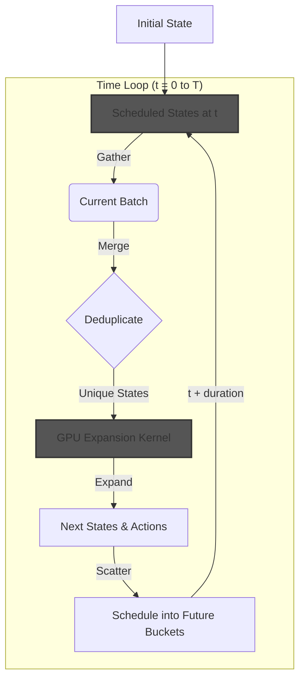
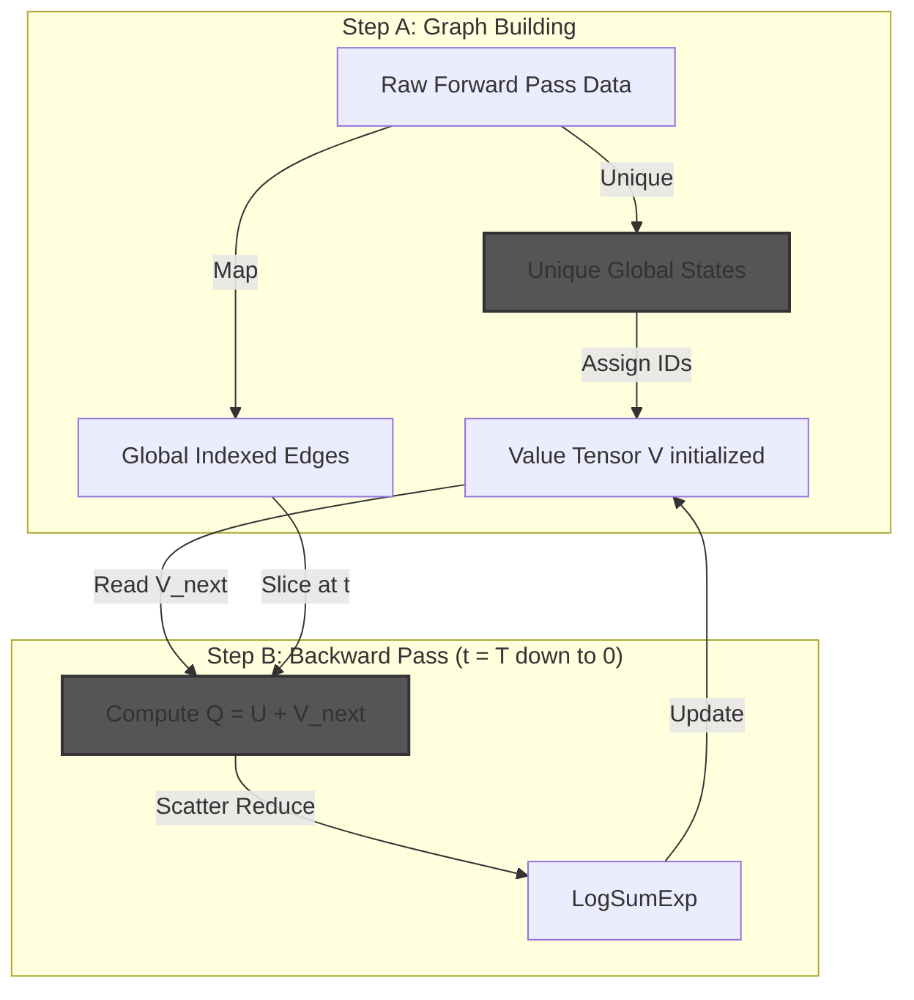
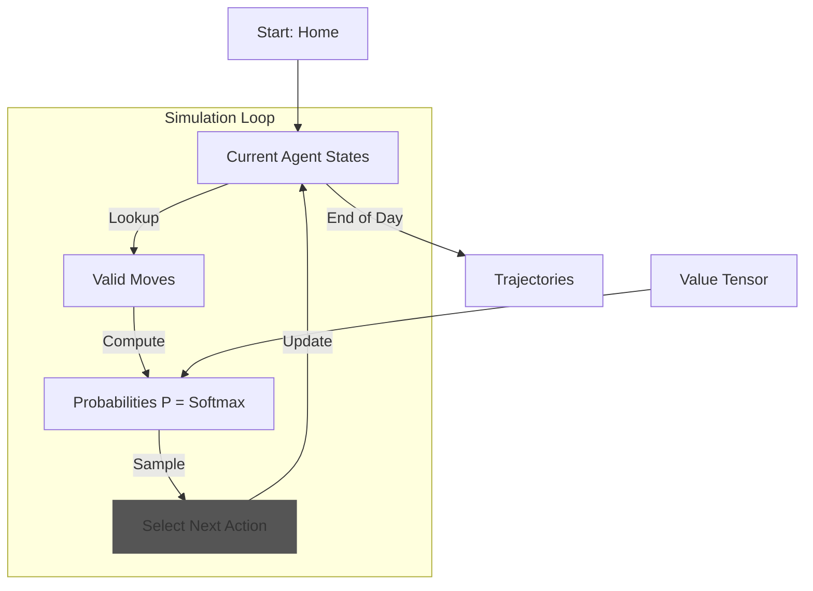

# DDCM Algorithm Summary: GPU/Tensor Implementation

This document provides a comprehensive summary of the Dynamic Discrete Choice Model (DDCM) simulation, specifically focusing on the optimized **Tensor-Based (GPU)** implementation. It covers the high-level workflow, mathematical formulation, and calibration results.

---

## 1. Algorithm Workflow

The simulation proceeds in three distinct phases, orchestrated by `main.py`. The tensor-based implementation replaces Python objects with PyTorch tensors to achieve massive parallelism.

### Phase 1: Forward Pass (Reachability Analysis)

### Phase 2: Backward Induction (Value Iteration)

### Phase 3: Simulation (Choice)

### Phase 1: Forward Pass (Reachability Analysis)

**Goal**: Discover all reachable states in the state space $S$ and build the transition graph.

**Class**: `planning.forward_pass_tensor.TensorForwardPass`

The algorithm uses a **Level-Synchronous BFS** with **Time Buckets** to ensure correct ordering and efficient deduplication.

1.  **Initialization**: Start with `initial_state` (Home, t=0) as a tensor $(1, 8)$.
2.  **Time Loop**: Iterate $t$ from $0$ to $T_{end}$ (e.g., 1440 min).
    *   **GATHER**: Collect all state tensors scheduled for time $t$.
    *   **MERGE**: Concatenate and deduplicate using `torch.unique`. This merges paths arriving at the same state from different origins.
    *   **EXPAND**: Use `GPUStateExpansionKernel` to generate all valid actions and next states in parallel.
    *   **SCATTER**: Schedule resulting `next_states` into future time buckets based on their arrival time ($t + \text{duration} + \text{travel\_time}$).

**Key Components**:
*   **State Tensor**: States are packed into `(N, 8)` integer tensors: `[Time, Zone, Activity, Duration, Mode, CarInUse, MotoInUse, History]`
*   **GPU Kernel**: Generates candidate actions (sparse lookup), filters invalid actions (vectorized constraints), and computes transitions (vectorized physics).

### Phase 2: Backward Induction (Value Iteration)

**Goal**: Compute the optimal Value Function $V(s, t)$ for every state.

**Classes**: `planning.graph_builder_tensor.GraphBuilder`, `planning.backward_induction_tensor.BackwardInduction`

1.  **Graph Construction**: Convert raw forward pass results into a structured **Sparse Graph**.
    *   Assign unique global indices to states.
    *   Map "raw" next states to global indices.
    *   Sort edges by source index.
2.  **Vectorized Backward Pass**: Iterate backwards from $T_{end}$ to $0$.
    *   **Slice**: Identify all edges originating from states at time $t$.
    *   **Compute Q**: Calculate $Q(s, a) = u(s, a) + V(s_{next})$ for all edges simultaneously.
    *   **Aggregate**: Compute $V(s) = \text{LogSumExp}(Q(s, \cdot))$ using a **scatter-reduce** operation.

### Phase 3: Simulation (Forward Simulation)

**Goal**: Generate daily activity-travel schedules for a population of agents.

**Class**: `planning.simulate_batch_tensor.simulate_batch_tensor`

Simulates $N$ agents (e.g., 1,000) in parallel on the GPU.

1.  **Initialization**: All agents start at `initial_state`.
2.  **Step Loop**: Until all agents reach $T_{end}$:
    *   **Lookup**: Find valid edges for current states in the global graph.
    *   **Probabilities**: Compute $P(a|s) = \text{softmax}(u(s, a) + V(s_{next}))$.
    *   **Sample**: Sample next actions for all agents using `torch.multinomial`.
    *   **Update**: Move agents to next states.
3.  **Decoding**: Convert the resulting tensor trajectories into human-readable DataFrames (CSV format).

---

## 2. Mathematical Formulation

### Tensor State Representation

States are represented as rows in a compact integer tensor $\mathbf{S}$ of shape $(N, 8)$.

$$
s = [t, z, a, d, m, x_{car}, x_{moto}, h]
$$

Where:
*   $t$: Time step (minutes from midnight)
*   $z$: Zone ID (integer)
*   $a$: Activity Type ID (integer)
*   $d$: Duration (time steps spent in current activity)
*   $m$: Transport Mode ID (integer, NONE if stationary)
*   $x_{car}, x_{moto}$: Vehicle availability (boolean)
*   $h$: Activity History (counter for mandatory sequence)

### Vectorized Utility Computation

The utility $u(s, a)$ is computed in parallel for a batch of $M$ edges.

$$
u_{total} = u_{travel} + u_{change} + u_{tail} + u_{partial} + u_{act} + u_{start}
$$

Broken down into component tensors:
1.  **Travel Utility**: Lookup from OD Tensor $\mathbf{T}_{OD}$ and $\mathbf{C}_{OD}$.
2.  **Activity Utility**: Marginal utility of performing activity $a$ for duration $\Delta t$.
3.  **Penalties**: Constant penalties based on action type masks.

### Vectorized Backward Induction (Bellman Equation)

The Bellman equation is solved backwards:

$$
V(s, t) = \ln \sum_{a \in A(s)} \exp \left( u(s, a) + V(s', t+\Delta t) \right)
$$

**Vectorized Implementation (Scatter-Reduce)**:
Given a batch of edges at time $t$ with source indices $\mathbf{I}_{src}$, target indices $\mathbf{I}_{tgt}$, and utilities $\mathbf{U}$:

1.  **Compute Q-Values**: $\mathbf{Q} = \mathbf{U} + \mathbf{V}[\mathbf{I}_{tgt}]$
2.  **Scatter LogSumExp**: Aggregate $\mathbf{Q}$ values by their source index $\mathbf{I}_{src}$.
    $$
    \mathbf{V}_{new}[k] = \text{LogSumExp}(\{ \mathbf{Q}[i] \mid \mathbf{I}_{src}[i] = k \})
    $$

### Simulation Probabilities

For a given agent at state $s$, the probability of choosing action $a$ is:

$$
P(a|s) = \frac{\exp(u(s, a) + V(s'))}{\sum_{a'} \exp(u(s, a') + V(s'_{next}))}
$$

**Batch Sampling**:
1.  **Logits**: $\mathbf{L} = \mathbf{U}_{batch} + \mathbf{V}[\mathbf{I}_{tgt\_batch}]$
2.  **Probabilities**: $\mathbf{P} = \text{softmax}(\mathbf{L}, \text{dim}=1)$
3.  **Sampling**: $a_{selected} \sim \text{Multinomial}(\mathbf{P})$

---

## 3. Results and Calibration

### Calibration Metrics (1,000 Agents)

*   **Activity Frequency**:
    *   HOME: 31.7%
    *   SCHOOL: 16.5%
    *   WORK: 12.5%
    *   SHOPPING: 5.3%
*   **Mode Shares**:
    *   WALK: 81.2%
    *   BUS: 18.8%
*   **Start Times**:
    *   WORK: Mean ~8:22 AM.
    *   SCHOOL: Mean ~7:56 AM.

### Computational Performance (GPU vs CPU)

The Tensor-based GPU implementation provides significant speedups:

| Phase | Original (CPU) | Tensor (GPU) | Speedup |
| :--- | :--- | :--- | :--- |
| **Forward Pass** | ~78s | ~10-15s | **~5-8x** |
| **Backward Induction** | ~45s | ~2-5s | **~10-20x** |
| **Simulation (1k)** | ~120s | ~5s | **~24x** |
