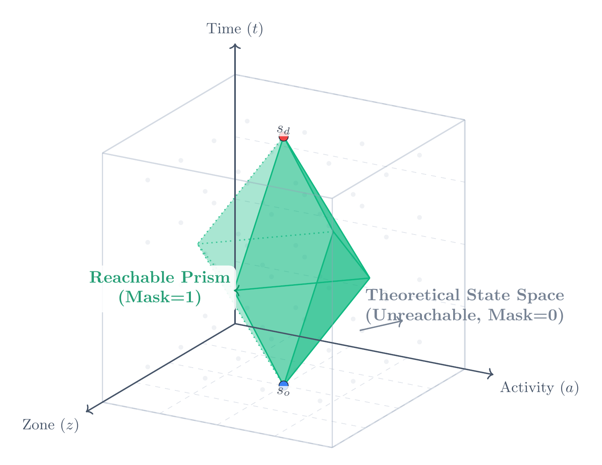
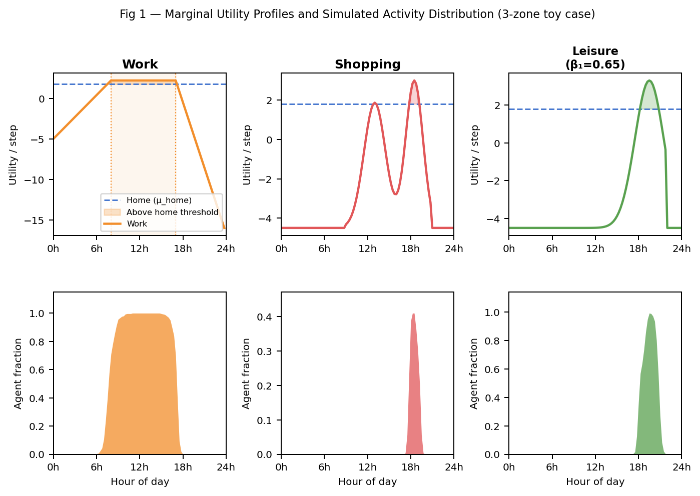
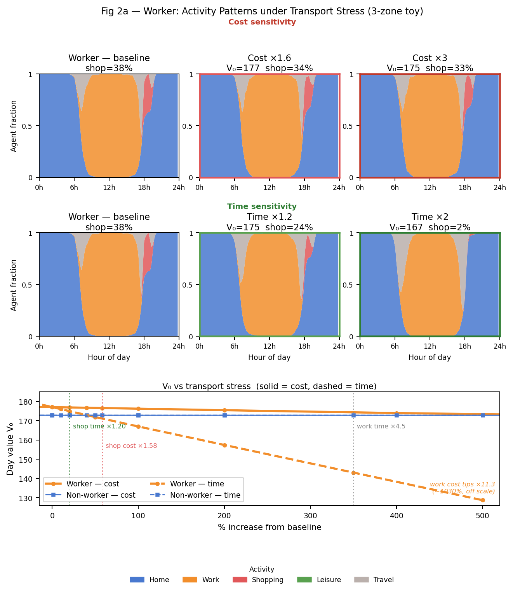
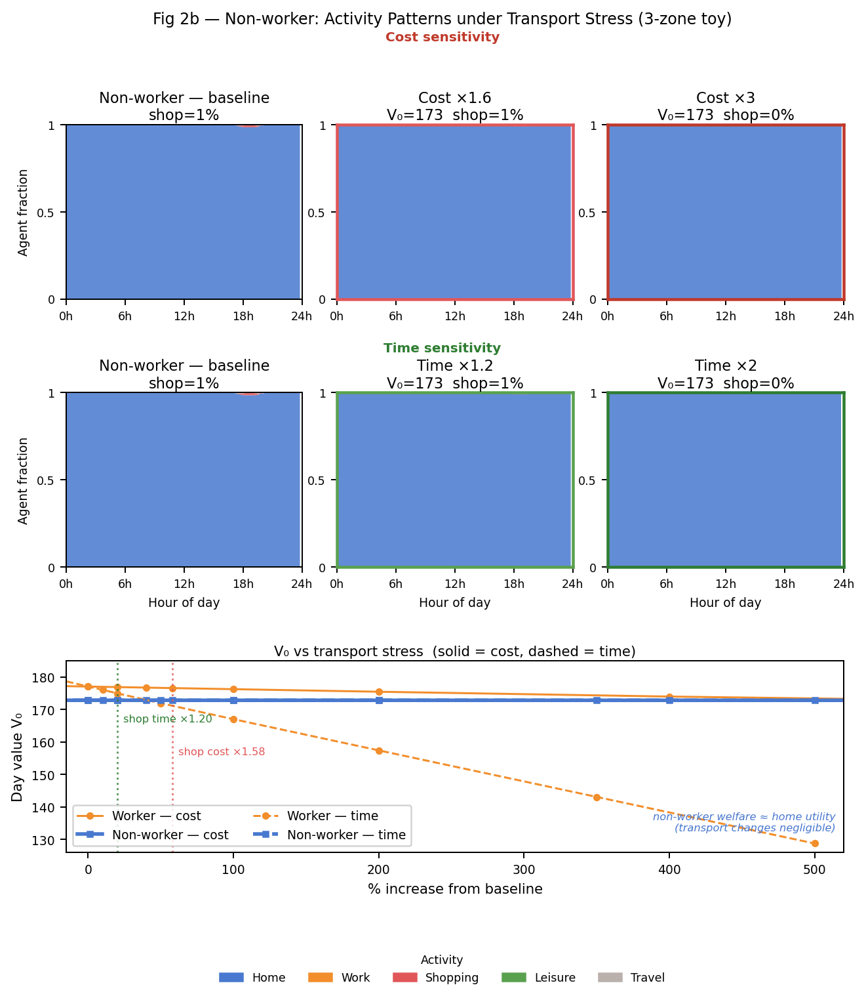
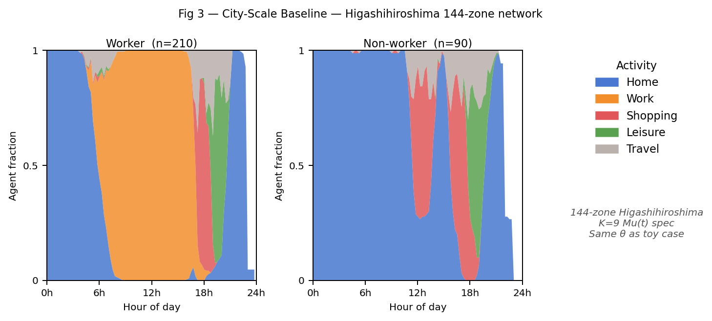

# 260419 — Master Thesis Progress (M2, April 2026)

> This report is the written companion to the April 2026 Master Thesis Progress presentation. It covers what has changed since last semester, the three framework contributions, the new μ(t) utility specification, computational + behavioural + city-scale results, current estimation progress, and what's next.
>
> **Slide source:** `4 - Projects/ddcm/ddcm_slides/slides.md` · **PDF export:** `4 - Projects/presentations/` (after export).

---

## 1. The big picture in one paragraph

I am building a computational framework that makes **activity-based DDCM estimation tractable at city scale**, and re-specifying its utility so that **activity timing emerges from preferences** rather than from hard-coded rules. Two things have historically blocked this: the state space for a real city is ~145 million states (so estimating is a 1,000-CPU-day / 6.7 TB problem), and classic specs bolt hard time windows onto the model, so timing is a model input rather than a model output. My contribution has three pieces that plug together and fix both: **DDCM as a DAG**, **reachability-based pruning**, and **μ(t) utility profiles**. End-to-end, the full pipeline runs in ~**105 seconds** instead of ~69 hours on a 144-zone Higashi-Hiroshima network, with memory dropping from 6.7 TB to 6.5 GB — and behaviour like timing, durations, and trip counts is now fully endogenous.

## 2. What changed since last semester

The big shift is that I stopped treating activity-based DDCM as a giant tensor and started treating it as a **graph problem**. Once you see it as a graph, two things fall out for free: GPU parallelism (each time level is independent), and the ability to throw away states nobody can ever reach.

| Piece | Last semester | Now | Why |
|---|---|---|---|
| State representation | Tensor indexed by `(t, zone, activity, duration, mode, vehicle, history)` | **DAG** — time-ordered levels of reachable states | Makes time-level independence explicit. GPU can process one level per kernel. |
| State-space control | Full Cartesian product + masks | **Forward reachability pruning** via BFS + Hägerstrand prism | Most 145M states are physically impossible. Exact, no approximation. |
| Utility spec | Schedule-delay penalties + **hard time windows** | **μ(t)** time-varying marginal-utility profile | Hard windows make timing an input. μ(t) lets it emerge from preferences. |
| Population handling | Ad-hoc | **Shared universal graph per activity-sequence group** | Same-type agents share one DAG. Graph built once, masks per individual. |
| Estimation gradient | Finite differences | **Analytical gradient** via second BI pass (Fosgerau et al., 2013) | Exact and cheap — same cost order as inner BI, not 2k× slower. |

What was **kept**: the NFXP estimation structure, the Bellman recursion itself, and the log-sum consumer-surplus interpretation.
What was **dropped**: the RMDP / lifted track, finite-difference gradients, hard time windows as primitives.

## 3. The framework — three contributions

### 3.1 DDCM as a DAG

Time only moves forward → the state-transition graph has **no cycles**. Backward induction on a finite-horizon DDCM is exactly a reverse topological traversal over a Directed Acyclic Graph.

Why this matters operationally:
- DAG levels are independent → GPU processes each level in a single batched kernel.
- Only reachable nodes are needed → motivates Contribution 2.
- Same-type agents share one graph; individual constraints (home zone, work zone, diary windows) apply as **masks** at simulation time.

Bellman structure maps one-to-one onto the graph: states → vertices, actions → edges, forward BFS → reachability, backward BI → reverse traversal.

### 3.2 Reachability-based pruning

Out of ~145M nominal states, most are physically unreachable: no agent can be in two zones 30 km apart in consecutive 15-minute intervals. A **level-synchronous forward BFS** (Berrendorf et al., 2014) from the feasible initial states, embedding **Hägerstrand space-time prism** constraints (Hägerstrand, 1970; Oyama & Hato, 2019), keeps only what an agent can actually reach.

Result: **145M → 1.5M nodes (~1% of nominal)**, stored as CSR (compressed sparse row). **Exact** — same value functions as the unpruned graph, because unreachable states contribute zero to everyone's $\bar V$ by definition.

### 3.3 μ(t) — marginal-utility profiles

A trip from home to activity $a$ is worthwhile when its **net value** beats staying home:

$$
\mu_a(t)\cdot\Delta t \;-\; \theta_\text{travel}\cdot v_m(l,d,t) \;-\; 2|c_\text{change}| \;+\; \bar V(\text{dest}) \;>\; \mu_\text{home}\cdot\Delta t \;+\; \bar V(\text{home})
$$

The logit kernel makes this probabilistic — every feasible action keeps a positive probability; the utility gap controls the ratio. Four profile types cover the whole specification:

- **Home** (`μ_home`): flat constant. Every trip must clear this floor.
- **Work / School** (`δ, α, β`): piecewise-linear around the agent's scheduled window $(t_s, t_e)$ — flat at $\delta$ on-schedule, linear earliness penalty $\alpha$ before $t_s$, linear lateness penalty $\beta$ after $t_e$. The window is a **diary input**, not a model constraint.
- **Shop / Leisure** (`β₁, β₀`): business-hour driven, $\mu = \beta_1 P_\text{open}(z,t) + \beta_0$. $P_\text{open}$ is fit from Google Maps POI data using a Gaussian mixture — so timing tracks when places are open, by construction.
- **Travel** (`θ_travel`): scales MNL mode utility so MNL and DDCM scales align.

**Full one-stage utility:** $u = \mu_a(t)\cdot\Delta t + \theta_\text{travel}\cdot v_m(l,d,t)$.

Ten parameters total: 3 for work, 2 each for shop and leisure, 1 home floor, 1 switching cost, 1 travel scale. Everything else — start times, durations, trip counts, mode shares — is **endogenous output** of the model.

**The behavioural anchors** are $c_\text{change}$ and $\mu_\text{home}$. Every trip must clear $\mu_\text{home}$ and pay $2|c_\text{change}|$, so together they set the cost of moving and hence how often anyone does anything. Watch these two — we'll see them again in §7.

*Grounded in the temporal-utility-profile framework of Supernak (1992) and Joh et al. (2003).*

## 4. Computational results

| Metric | Conventional | Proposed | Ratio |
|---|---|---|---|
| States processed | 145 M | **1.5 M** | 99% reduction |
| Full-pipeline time | ~69 hours (est.) | **105 seconds** | ~2,400× |
| Memory | 6.7 TB Q-table | **6.5 GB** CSR graph | ~1,000× |
| Per-agent likelihood | 121 ms | 3.9 ms | ~31× |
| Simulation (1,000 agents) | — | 3.9 seconds | — |

Three multiplicative effects stack to produce the 2,400×: reachability pruning (~100×), GPU-parallel BI over the DAG (~10–30×), and shared-graph-per-group (~5–10×). **No approximation** — $\bar V$ matches the unpruned-graph result to floating-point precision.

The 69-hour comparison is BI over the unpruned 145M-state Cartesian product. The 105-second number includes the forward BFS plus pruned BI on the CSR graph. Same value functions, same choice probabilities; only the representation changed.

## 5. Toy-case behavioural validation

Before estimating on real data, we need to answer: *does the new μ(t) spec produce realistic daily activity patterns **without any hard-coded rules**?* We test on a 3-zone synthetic network with 300 agents. All results here are simulation, not estimation.

### 5.1 Activity emergence from μ(t)

Top row: the μₐ(t) profiles themselves. Bottom row: what 300 simulated agents actually do.

- **Work (column 1).** Piecewise profile exceeds the home floor from ~7 am to ~6 pm. Simulation: almost everyone at work 8 am–5 pm. **Nothing forced this** — agents depart when work utility beats home, return when lateness erodes it below home.
- **Shop (column 2).** $P_\text{open}$-driven, peaks mid-morning and late afternoon. Simulation: shopping clusters after work. The "after-work shopping" pattern is *not encoded* — it falls out of (a) when shops open and (b) when workers are free.
- **Leisure (column 3, demo).** At baseline $\beta_{1,\text{leis}} = 0.4$, leisure utility never clears the home floor → no leisure trips. The figure raises it to 0.65 to show what leisure looks like *when activated*. There's an activation threshold around 0.525 — leisure isn't suppressed by a rule, just by the arithmetic.

All five baseline sanity checks pass: home at night; work dominates daytime; correct trip counts; emergent work-start windows; mode shares match the MNL priors.

### 5.2 Transport stress — workers

Three rows: cost sensitivity (×1.0, ×1.58, ×3.0), time sensitivity (×1.0, ×1.20, ×2.0), combined $V_0$ welfare panel.

**Key findings:**

1. **Workers are cost-resilient.** At ×3.0 cost, the work block is unchanged and $V_0$ barely moves (177 → 175). The commute has net value +8.26 — cost can't suppress it. What drops is discretionary shopping (38% → 33%).
2. **Workers are time-sensitive.** +20% travel time cuts shopping from 38% to 24% — a bigger effect than +58% cost. At ×2.0 time, shopping collapses to 2% and $V_0$ falls to 167 (−10 units).
3. **Why the asymmetry.** The commute is non-negotiable. When travel time doubles, round-trip commute doubles and eats directly into work utility. Cost has no such mechanism.
4. **Tipping points.** Shop: time ×1.20, cost ×1.58. Work: time ×4.5, cost ×11.3 (off-scale). **Time is the binding resource for workers.**

### 5.3 Transport stress — non-workers

The striking finding: almost nothing happens. Baseline $V_0 = 172.8$, which is *exactly* $\mu_\text{home} \times \Delta t \times 96\text{ steps} = 0.12 \times 15 \times 96$. Non-worker welfare is the utility of staying home all day. Under cost ×3.0: $V_0 = 173$. Under time ×2.0: $V_0 = 173$. Both blue lines in the welfare panel are flat throughout.

This is a **correct prediction, not a bug**. Non-workers have no mandatory exposure — when transport worsens, they just stay home and lose essentially nothing. Policy implication: transport-improvement benefits accrue to workers, not to non-workers.

The 4.2-unit baseline gap between worker (177) and non-worker (172.8) welfare is *the value of work itself* — having something worth doing outside home. Under extreme time stress, workers can fall *below* non-workers because their commute burden exceeds their work utility gain.

## 6. City-scale simulation — Higashi-Hiroshima

Same framework, unchanged, on a real city: 144 zones, 5 modes, 300 agents (210 workers + 90 non-workers), 4 activity-sequence groups covering the full population through the shared universal graph. **Full baseline simulation finishes in under 3 minutes.**

Qualitative patterns are preserved from the toy case: workers have an 8–5 orange work block with late-afternoon shopping; non-workers are nearly all-home. The 144-zone network adds heterogeneity in travel times → smoother work-block transitions than the sharp toy-case on/off.

**Scope note.** This is *computational* validation, not *behavioural* validation. The K=9 parameters here are the toy-case values, not estimated from HH survey data. Full behavioural interpretation requires the estimation in §7 to converge on real data.

## 7. Estimation

### 7.1 NFXP pipeline with analytical gradient

Nested Fixed Point (Rust 1987; Västberg et al., 2020): outer BFGS over the 10 parameters, inner backward induction for the value function per candidate $\theta$. The log-likelihood

$$
\ell(\theta) = \sum_{n,k}\log P(a_{k,n}\mid s_{k,n};\theta),
\qquad
P(a\mid s;\theta) = \exp[u(s,a;\theta) + \bar V(s';\theta) - \bar V(s;\theta)]
$$

is maximised by BFGS until $\|\nabla\ell\|_\infty < 10^{-3}$.

Gradient via **analytical differentiation of the Bellman recursion** (Fosgerau et al., 2013; Baydin et al., 2018):

$$
\frac{\partial\ell}{\partial\theta_q} = \sum_{n,k}\left[x^q_{k+1\mid k} - \frac{\partial\bar V(s_{k,n})}{\partial\theta_q}\right],
\qquad
\frac{\partial\bar V}{\partial\theta_q}\text{ solved by the same Bellman recursion.}
$$

Cost per BFGS iteration: **2× BI** (one forward/standard, one derivative), not 20× as finite differences would need. At 1,368 persons / 29 groups, wall time is ~31 min/iter.

### 7.2 Current run (2026-04-17/19, 1,368 workers, bounded c_change)

After a previous 316-worker run converged into a degenerate basin at $c_\text{change} \approx -3.86$, three changes were made:

1. Sample scaled to 1,368 workers / 29 groups (≥10 persons/group).
2. **Bound** $c_\text{change} \in (-2.5,\,0)$.
3. Warm-start from iter-11 of an earlier OOM-corrupted parallel run, with $c_\text{change}$ reset to $-0.3$.

**Result at best checkpoint (iter 19):**

| Parameter | Initial (warm-start) | Final | Status |
|---|---|---|---|
| $\delta$ | 0.0229 | **0.0266** | moved ✓ (right sign) |
| $\alpha$ | 0.00101 | 0.00102 | frozen |
| $\beta$ | 0.00300 | 0.00300 | frozen |
| $\beta_{1,\text{shop}}$ | 0.279 | 0.281 | small |
| $\beta_{0,\text{shop}}$ | −0.901 | −0.871 | moved |
| $\beta_{1,\text{leis}}$ | 0.381 | 0.353 | moved |
| $\beta_{0,\text{leis}}$ | −0.193 | −0.162 | moved |
| $c_\text{change}$ | −0.300 | **−2.500** ⚠ | **HIT BOUND** |
| $\mu_\text{home}$ | 0.101 | **0.102** | frozen (right sign) |
| $\theta_\text{travel}$ | 1.574 | 1.999 | large movement |

**Summary metrics:** best $\ell = -28{,}708.6$; $\|\nabla\ell\|_\infty = 0.78$ (threshold 0.001); **partial convergence**; BFGS terminated at iter 35 with *"desired error not necessarily achieved due to precision loss"*.

**What went right.** $\delta$ and $\mu_\text{home}$ now carry the expected positive signs (they were negative in the previous SRS200 run — the scale-up + warm-start escaped that wrong local optimum). Pipeline is end-to-end stable.

**What didn't.** $c_\text{change}$ is pinned at the lower bound; gradient w.r.t. $c_\text{change}$ stayed negative throughout. Activity parameters barely moved from warm-start — 13 consecutive plateau iterations at $\ell \approx -28{,}709$. $\theta_\text{travel}$ ran off to 2.0, roughly double the MNL-aligned prior.

### 7.3 Diagnosis — suspected identification ridge

> **Suspected**, not proven, under investigation.

The likelihood has a **shallow ridge along the $c_\text{change}$ direction**. Intuition: $c_\text{change}$ enters twice per trip, so it controls how many trips happen regardless of activity utility. When $|c_\text{change}|$ is large, inertia reproduces any observed schedule, making the activity utilities weakly identified — the data's information about them gets absorbed into the switching cost.

If this is right, it's an **identification issue, not an optimiser issue**. Multi-start BFGS, tighter tolerances, different step rules — none of them will fix a flat ridge.

### 7.4 Brief recommendation — the c_change issue

1. **Verify the formulation first.** Compute the score w.r.t. $c_\text{change}$ over a range of values; check whether the sign ever flips. Because $c_\text{change}$ is applied twice per trip, the score is essentially a count statistic on trips — if observed trip count exceeds predicted trip count at every reasonable $c_\text{change}$, the gradient never changes sign by construction. **Cost:** design work only, no compute.
2. **Profile-likelihood sweep** over $c_\text{change} \in \{-2.5, -2.0, -1.5, -1.0, -0.5, -0.3, 0\}$: 7 short warm-started BFGS runs × ~1–2 hours each. Directly visualises the ridge. If $\ell$ is flat, $c_\text{change}$ is not separately identified. If $\ell$ has a clear peak, that point is the MLE.
3. **Paper-ready fallback:** fix $c_\text{change}$ at the MNL switching-cost prior ($-0.3$) and estimate the remaining 9 parameters. Yields a fully identified submodel, presented honestly as *"conditioning on the MNL switching-cost prior."* **Cost:** one overnight run.

**Recommended order:** 1 → 2 → 3. Action 1 is free and might reveal a formulation bug. Action 2 is the empirical test. Action 3 is the fallback.

## 8. What's next

1. **Converge the estimation** — diagnose the $c_\text{change}$ ridge via the three actions above. Expected completion 2–3 weeks.
2. **Welfare analysis at city scale** — log-sum consumer surplus on HH under transport-cost and travel-time policy scenarios. Feeds the paper write-up.
3. **μ(t) theory** — alternative profile shapes (Gaussian for work, splines), zone-level heterogeneity in $(\beta_1, \beta_0)$, sensitivity analysis.
4. **Complete the paper** — three contributions + μ(t) + converged estimates + city-scale welfare. Submittable by end of M2.
5. **Broader PhD direction — DDC-Bridge.** Connecting DDCM to RL and DL via two proven bridges: MaxEnt IRL ≡ logit DDC (Ermon et al., 2015); DDCM backward induction ≡ layered networks over the log-semiring (Dudzik & Veličković, 2022). That's Phase C of the research plan.

---

**Session data source:** `0 - Inbox/comingFromCode/session_report_20260419.md` (full iteration log, runtime profile, disk/memory details).
**Slides:** `4 - Projects/ddcm/ddcm_slides/slides.md` · **PDF export:** `4 - Projects/presentations/` after export.
**Related in vault:** `3 - Permanent Notes/research-plan/RESEARCH_PLAN.md`, `5 - Indexes/index-ddcm.md`.
