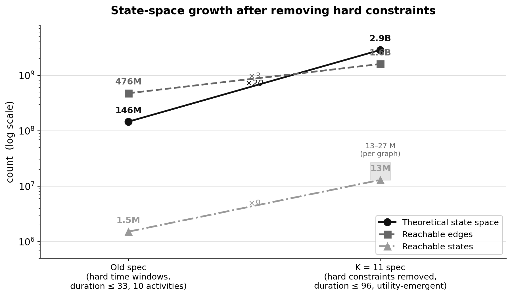

<div class="flex items-center justify-center gap-12 mb-8 opacity-90">
  
  
</div>

# Inside the DDCM Engine
## A GPU-Accelerated Codebase Walkthrough

<div class="text-lg text-gray-500 italic mt-2">End-to-End Technical Walkthrough · 2026</div>

<div class="mt-10 flex flex-col items-center gap-1">
  <div class="text-xl font-semibold">Azwan Nazamuddin</div>
  <div class="text-sm text-gray-500">Graduate School of Innovation and Practice for Smart Society</div>
  <div class="text-sm text-gray-500">Hiroshima University</div>
</div>

<div class="mt-6 flex flex-col items-center gap-1">
  <div class="text-base text-gray-600">Supervisor — Prof. Makoto Chikaraishi</div>
</div>

<!--
[~10s] This walkthrough covers the full DDCM codebase end-to-end — from the problem statement and mathematical foundation through every engineering decision needed to make city-scale estimation tractable on a single machine.
-->

---

# Story Arc

<div class="grid grid-cols-2 gap-6 mt-6">
<div class="p-4 bg-gray-50 rounded-xl border border-gray-200">

**Orientation**
- Codebase map: 4 top-level folders
- Two pipelines, one shared DP engine
- The machine: M2 Ultra, 512 GB unified

</div>
<div class="p-4 bg-gray-50 rounded-xl border border-gray-200">

**Data & Representation**
- Surveys → tensors
- State encoding, 39-bit hash

</div>
<div class="p-4 bg-gray-50 rounded-xl border border-gray-200 mt-4">

**Computation**
- Phase 1A: Forward pass BFS
- Phase 1B: Backward induction (soft Bellman)

</div>
<div class="p-4 bg-gray-50 rounded-xl border border-gray-200 mt-4">

**Estimation & Acceleration**
- NFXP loop + LL, analytical gradient (GV)
- Custom Metal kernels

</div>
</div>

<div class="p-4 bg-gray-100 rounded-xl border-2 border-gray-800 text-center mt-4">
<strong>Output</strong>: Simulation, Policy Analysis, Welfare
</div>

<!--
[~20s] Here's the story arc — a top-to-bottom walk through the codebase. We start with orientation: the folder layout and the machine. Then data structures, the two-phase computation — forward pass and backward induction — the estimation loop and its analytical gradient, the GPU acceleration, and finally what the model produces once we have estimates. The math we need — the soft Bellman equation, the utility functions, the log-likelihood — appears inline at the code that implements it.
-->

---

# Pipeline Walkthrough

```
estimate.py
  └─ estimation/run_tensor_estimation.py :: main()
       ├─ estimation/data_loader.py :: load_dataset()          ← Data
       ├─ core/state_encoder.py :: StateEncoder                ← States
       ├─ Group persons by topology key (act_types, car_owned)
       └─ _run_nfxp_estimation()
            │
            ├─ Phase 1A — build graph topology  [once; θ-independent; cached to disk]
            │    estimation/graph_builder.py :: build_graph()
            │      planning/forward_pass_tensor.py :: TensorForwardPass  (BFS)
            │      planning/graph_builder_tensor.py :: GraphBuilder       (CSR)
            │
            ├─ Phase 1B — encode observed paths + initial V̄(θ₀)  [once at θ₀]
            │    estimation/nfxp_estimator.py :: encode_observed_steps()
            │    estimation/nfxp_estimator.py :: run_bi_for_group()
            │      planning/backward_induction_tensor.py :: BackwardInduction
            │
            └─ Phase 2 — NFXP optimizer loop  [every BFGS iteration]
                 neg_loglik(θ):  set_params → recompute utilities → BI → compute_exact_ll
                 grad(θ):        same + planning/gv_backward_tensor.py :: GVBackward
```

Phase 1A is cached to disk after the first run. Only Phase 2 repeats inside the optimizer.

<!--
[~30s] Two entry points: estimate.py drives data loading, graph build, BI, and the NFXP loop. simulate.py picks up from estimated params and runs the same graph build and BI, then samples trajectories. The pipeline splits into a one-time half — Phase 1A builds the graph and Phase 1B encodes the observed paths — and a repeated half that runs every BFGS iteration. Phase 1A is disk-cached. That repeated half is where speed matters.
-->

---

# How to Read Along

This deck is the **reading guide** for walking the codebase together — top to bottom in pipeline order.

<div class="grid grid-cols-2 gap-4 mt-4">
<div class="p-4 bg-gray-50 rounded-xl border border-gray-200">

**The pipeline tree** (recurring slide) is the map. Highlighted lines = where we are now.

Each **section opens** with two anchors:
- 📖 **Read along** — the module `README.md` for that stage
- ▶ **Code path** — the functions to open, in call order

</div>
<div class="p-4 bg-gray-50 rounded-xl border border-gray-200">

**On each content slide:**
- The `> file.py → function()` line = the exact code that slide explains
- Code blocks are **excerpts** — open the real file to read the rest
- Inline comments explain **WHY** (hidden constraints, workarounds), not WHAT

</div>
</div>

<div class="p-3 bg-gray-100 rounded-xl border border-gray-400 mt-4 text-center text-sm">
<strong>README = source of truth.</strong> When a slide and a README disagree, the README + the code win.
</div>

<!--
[~25s] One slide on how to use this deck. We read the codebase in pipeline order — the recurring tree slide shows where we are. Every section divider gives you two things to open: the module README for that stage, and the code path — the functions to walk through in call order. On the content slides, the quoted file-and-function line is the exact code that slide is about; the code blocks are excerpts, so have the real file open. And the inline comments tell you why a piece of code exists, not what it does — that's where the non-obvious decisions live.
-->

---
layout: section
---

# Codebase Orientation

Where the code lives + the machine it runs on

<div class="mt-8 mx-auto max-w-3xl text-left text-sm p-4 bg-gray-50 rounded-xl border border-gray-200">

📖 **Read along:** `README.md` · `CLAUDE.md`

▶ **Code path:** `estimate.py` → `estimation/run_tensor_estimation.py::main()` → `_run_nfxp_estimation()`

</div>

<!--
[~5s] Start with the lay of the land: the four top-level folders and the machine this runs on.
-->

---

# The Codebase at a Glance

```
data/ → estimation/ → planning/ → results/
         (pipeline    (DP engine)
          coordinator)
```

<div class="grid grid-cols-2 gap-4 mt-4">
<div class="p-3 bg-gray-50 rounded-lg border border-gray-200">

**`planning/` — DP engine**

```
forward_pass_tensor.py       ← BFS: build reachable graph
backward_induction_tensor.py ← Bellman: compute V(s)
scatter_logsumexp_mps.py     ← Custom Metal: 1.83× faster BI
gv_backward_tensor.py        ← GV recursion: analytical ∇
```

</div>
<div class="p-3 bg-gray-50 rounded-lg border border-gray-200">

**`estimation/` + `core/`**

```
nfxp_estimator.py  ← NFXP: BI inside optimizer
graph_builder.py   ← Phase 1A: build graph once
param_setter.py    ← K=11 parameters
data_loader.py     ← survey → observed paths

core/state.py, enums.py,
     state_encoder.py  ← shared data types
```

</div>
</div>

**Two pipelines share the same DP engine:** estimation (maximize LL) and simulation (sample trajectories).

<!--
[~30s] Four top-level folders. The DP engine in planning/ is the heart — forward pass builds the graph, backward induction solves for V, the custom Metal kernel makes scatter_logsumexp 1.83 times faster, and the GV backward sweep computes the analytical gradient. Estimation and simulation share this engine — only the outer loop differs.
-->

---

# Hardware & Current Run Scale

<style scoped>table { font-size: 0.72rem; }</style>

| Resource | Value |
|---|---|
| Machine | Apple M2 Ultra Mac Studio |
| Unified memory | 512 GB |
| GPU | MPS (Apple Silicon unified memory) |
| Peak RAM during BI | 197 GB <span class="text-gray-500 text-xs">(was a 615 GB OOM-kill before disk mode)</span> |
| Persons in sample | 6,948 |
| Topology groups | 4 graphs |
| Eval groups | ~102 (with `--scheduling-preferences`) |
| Phase 1A (graph build) | ~35 min per workers group |
| Phase 1B (BI at $\theta_0$) | ~40–58 s per group |
| Full BFGS iteration | ~7–10 hours |

The M2 Ultra's 512 GB unified memory is what makes this possible — CPU and GPU share one pool, so the 197 GB of V-tensors and edge data live in a single address space with no host↔device copies.

<!--
[~30s] We run on an M2 Ultra Mac Studio with 512 GB unified memory. Peak BI memory is 197 GB — well within headroom. The graph build for the workers group takes about 35 minutes, individual BI runs are 40 to 58 seconds per group, and a full BFGS iteration with gradient takes 7 to 10 hours.
-->

---

# State Space: Old Spec → Now

<div class="grid grid-cols-5 gap-5 items-center mt-2">
<div class="col-span-3">



</div>
<div class="col-span-2 text-sm">

**What changed (old spec → K=11):**
- Removed hard **time windows** → timing emerges from Mu(t)
- Removed **min/max duration caps** → duration 33 → 96 steps
- 10 activities → **4 active** (HOME/WORK/SHOP/LEISURE)

**Net effect:**
- Theoretical: 146 M → **2.9 B** (×20)
- Reachable states: 1.5 M → **13–27 M** (×~10)
- Reachable edges: 476 M → **1.6 B** (×3.4)

The duration uncap + window removal dominate — they more than offset cutting activities.

</div>
</div>

<!--
[~40s] This is the single biggest reason the engine looks the way it does. The old specification had hard time windows and min/max duration caps — engineering shortcuts that kept the reachable space small, about 1.5 million states. The K=11 redesign removed those: timing and duration now emerge from the Mu(t) utility gradients instead of being clamped. That uncapped duration from 33 to 96 steps and dropped the windows, exploding the theoretical space from 146 million to 2.9 billion, and the reachable graph from 1.5 million states to 13–27 million states and 1.6 billion edges per graph. Cutting activities from ten to four helped, but nowhere near enough to offset it.
-->

---

# Why Pruning + MPS Are Non-Optional

<div class="grid grid-cols-2 gap-5 mt-2">
<div class="p-4 bg-gray-50 rounded-xl border border-gray-200">

**Pruning is the only thing that fits**

Full Q-table, every (state × action) stored:
- Old spec: **6.7 TB**
- K=11 spec: **~90 PB** &nbsp;<span class="text-gray-500 text-xs">(2.9 B × 7,776 actions × 4 B)</span>

BFS reachability + the 11 constraint filters prune **~99.5%** of the theoretical space — only the ~13–27 M reachable states per graph are ever built or solved.

</div>
<div class="p-4 bg-gray-100 rounded-xl border-2 border-gray-800">

**Why unified memory matters**

Even pruned, one gradient eval holds a **197 GB** working set (V-tensors + CSR edges).

- M2 Ultra **512 GB unified** → CPU + GPU share one pool, 197 GB resident with **no host↔device copies**
- The working set never has to be split or streamed across a separate device memory

→ Unified memory is the enabling hardware — **MPS is the only GPU, CPU the only fallback.**

</div>
</div>

<!--
[~40s] Two consequences follow from that explosion. First, pruning is not an optimization, it's the only thing that makes the problem exist at all: if we naively stored a Q-value for every state-action pair, the table would be 6.7 terabytes under the old spec and roughly 90 petabytes under K=11. The BFS reachability pass plus the eleven constraint filters throw away about 99.5 percent of the theoretical space, leaving the 13 to 27 million reachable states we actually solve. Second, even that pruned working set is 197 gigabytes per gradient evaluation. The M2 Ultra's 512 gigabytes of unified memory holds it resident in a single pool, with no need to split or stream it across a separate device memory. Unified memory is the enabling hardware — MPS is the only GPU, and CPU is the only fallback.
-->

---
layout: section
---

# Data Pipeline

Surveys → Tensors

<div class="mt-8 mx-auto max-w-3xl text-left text-sm p-4 bg-gray-50 rounded-xl border border-gray-200">

📖 **Read along:** `data/README.md` · `estimation/README.md` (Phase 0)

▶ **Code path:** `data_loader.py::load_person_day()` → `observed_path.py::grid_to_event_path()` → person grouping in `run_tensor_estimation.py`

</div>

<!--
[~5s] How do real survey data become the GPU tensors the DP engine consumes?
-->

---

# Pipeline — Data Loading

```{3}
estimate.py
  └─ estimation/run_tensor_estimation.py :: main()
       ├─ estimation/data_loader.py :: load_dataset()          ← Data
       ├─ core/state_encoder.py :: StateEncoder                ← States
       ├─ Group persons by topology key (act_types, car_owned)
       └─ _run_nfxp_estimation()
            │
            ├─ Phase 1A — build graph topology  [once; θ-independent; cached to disk]
            │    estimation/graph_builder.py :: build_graph()
            │      planning/forward_pass_tensor.py :: TensorForwardPass  (BFS)
            │      planning/graph_builder_tensor.py :: GraphBuilder       (CSR)
            │
            ├─ Phase 1B — encode observed paths + initial V̄(θ₀)  [once at θ₀]
            │    estimation/nfxp_estimator.py :: encode_observed_steps()
            │    estimation/nfxp_estimator.py :: run_bi_for_group()
            │      planning/backward_induction_tensor.py :: BackwardInduction
            │
            └─ Phase 2 — NFXP optimizer loop  [every BFGS iteration]
                 neg_loglik(θ):  set_params → recompute utilities → BI → compute_exact_ll
                 grad(θ):        same + planning/gv_backward_tensor.py :: GVBackward
```

<!--
[~5s] data_loader.py — the entry point for survey data into the pipeline.
-->

---

# Input Data Sources

<div class="p-3 bg-gray-50 rounded-lg border border-gray-200 text-sm mt-3">

**Travel diary survey — data/higashihiroshima/**

6,948 persons, one day each. Trip records: departure/arrival time, zone pair, mode, purpose.
Processed: 96 rows × 1 person per CSV (one row per 15-min slot).

</div>

<div class="p-3 bg-gray-50 rounded-lg border border-gray-200 text-sm mt-3">

**OD Level-of-Service — data/estimation_input/OD_LOS.csv**

$144 \times 144 \times 5$ modes — car/bus/train/walk/bicycle: time + cost.
Loaded into `ODLookupOptimized` → 3D NumPy array $(144, 144, 5)$.

</div>

<div class="p-3 bg-gray-50 rounded-lg border border-gray-200 text-sm mt-3">

**Zone attributes — zone_attractiveness_verified.csv + p_open_by_zone.parquet**

Retail / restaurant / cultural POI floor area → $X[z] \in [0,1]$.
$P_\text{open}[z,t]$: 96 time steps per zone (Google Maps scraping).

</div>

<!--
[~30s] Three data sources. The travel diary gives us observed sequences — 6,948 persons for one day each. The OD matrix gives travel times and costs between all zone pairs across five modes. Zone attributes plus opening probabilities feed the shopping and leisure utility functions. All three are loaded once at startup and shared across groups.
-->

---

# Survey → EventPath

**`estimation/data_loader.py::load_person_day()`** processes each person:

```
Raw trip record (Higashihiroshima survey)
    │
    ├── Mode filter: exclude Motorcycle, Taxi, Moped, Wheelchair
    ├── Home zone: hh_data.home_Bzone + home_Czone → Zone enum
    ├── Car ownership: from ind_data
    │
    ├── preprocess_person_csv()
    │     Collapse TRAVEL segments, compute Duration, map purpose → ActivityType
    │     → df_model: one row per activity episode
    │
    ├── derive_mandatory_sequence()  → [(ActivityType.WORK, Zone.CZONE_42), ...]
    └── derive_mandatory_timing()    → {ActivityType.WORK: (start_time, end_time)}
```

**`estimation/observed_path.py::grid_to_event_path()`** converts to decision language:

Each CSV row → `EventStep`: `state` (6-field State), `action` (dest_zone, mode, activity), `TT/td/tp` (observed travel time + rounding corrections)

<div class="p-3 bg-gray-100 rounded-lg border border-gray-400 text-sm mt-3">

**Known limitation**

**35% of travel episodes** have TT mismatch between survey data and OD table → silently dropped during graph encoding. See the **Phase 2 — NFXP** section for the McFadden conditioning argument.

</div>

<!--
[~40s] The data loader processes each person through a pipeline: filter excluded modes, identify home zone and car ownership, collapse raw trip records into activity episodes, then derive the mandatory sequence and schedule. The observed-path module converts the resulting per-step diary into EventStep objects — state, action, travel time — using the same 6-field encoding the BFS graph uses. The 35% TT mismatch is a known limitation I'll revisit in the Phase 2 NFXP section.
-->

---

# Person Grouping

**Why group?** Every person in the same group shares one state-action graph. One graph per person = 6,948 separate BI runs.

<div class="grid grid-cols-2 gap-4 mt-3">
<div class="p-3 bg-gray-50 rounded-lg border border-gray-200">

**Level 1 — Topology group (4 total)**

Key: `(mandatory_activity_types, car_owned)`

Example: `(WORK, car=True)` = all workers with a car

One shared graph per group — **θ-independent**, built once.

</div>
<div class="p-3 bg-gray-50 rounded-lg border border-gray-200">

**Level 2 — Eval group (~102)**

Key: `(topology_key, timing_bucket)`

`timing_bucket = rounded(t_s, t_e)` at 30-min precision

Each group: own `work_schedule = median(t_s, t_e)` for $\mu_\text{work}(t)$

30-min rounding: ~384 exact schedules → ~40 buckets per topology

</div>
</div>

**Why 30-min rounding?** Within a 30-min window, the $\mu_\text{work}$ difference is $\alpha \times 15\text{ min} \approx 0.015$ utils — smaller than survey measurement error. More persons per group → better statistical identification.

<!--
[~40s] Grouping is what makes batch BI tractable. Two levels: topology groups share the CSR graph structure — only 4 of them, built once, never rebuilt when theta changes. Eval groups add scheduling preferences — about 102 groups after 30-minute rounding collapses the near-continuous schedule distribution. Each eval group has its own work-schedule median for the piecewise-linear utility, but shares the graph topology of its parent group.
-->

---

# The State Vector & 39-Bit Hash

**Every state is a 6-field `int16` vector:**

<style scoped>table { font-size: 0.72rem; }</style>

| Col | Field | Range | Notes |
|---|---|---|---|
| 0 | time | 0–1440 | Minutes from midnight, multiples of 15 |
| 1 | zone | 0–143 | Zone enum value |
| 2 | previous_activity | 0–9 | ActivityType enum |
| 3 | duration | 0–96 | Steps in current activity |
| 4 | mode | 0–8 | TransportMode enum; NONE at HOME |
| 5 | activity_history | 0–3 | Mandatory activities completed |

**39-bit bijective hash** (collision-free by construction):

```python
hash = (time << 28) | (zone << 20) | (act << 16) | (dur << 8) | (mode << 4) | hist
     # = 11b     +  8b      +   4b    +   8b    +   4b     +  4b  = 39 bits total
```

Used in three places: BFS deduplication, CSR target lookup, observed-path encoding. **All three must use the exact same formula** or states from one context won't be found in another.

<!--
[~35s] The 6-field int16 vector is the universal currency of the system. Everything — BFS frontier, BI V-tensor, observed diary steps — uses the same encoding. The 39-bit hash packs all six fields into one int64 for fast deduplication and lookup. All three uses of the hash must use the identical formula; a single-bit discrepancy would cause observed diary steps to silently miss their graph nodes.
-->

---

# What Gets Passed to the Optimizer

After Phase 1B, each eval group contributes one entry to `groups_nfxp`:

```python
{
  'states_tensor':  (N, 6) int16         # all reachable states
  'graph':          CSR dict             # row_ptr, col_idx, actions (NO utilities)
  'persons':        [{
      'obs_state_idxs': (T,) int64,      # FROZEN: CSR row index per diary step
      'obs_edge_idxs':  (T,) int64,      # FROZEN: CSR edge index per diary step
  }]
  'V_tensors':      {zone: (N,) float32} # recomputed every iteration
  'work_schedule':  (t_s, t_e) | None    # group-median schedule
}
```

`obs_state_idxs` and `obs_edge_idxs` are **frozen** — they're topology properties, not utility properties. They never change when $\theta$ changes. Freezing saves ~1,000 hash lookups per person per iteration.

<!--
[~30s] The groups_nfxp dict is the interface between Phase 1 and Phase 2. The graph topology — states, CSR, actions — is frozen. Only utilities and V_tensors are rewritten at each theta update. The observed-step indices are frozen too: once we know which CSR row and column correspond to each diary step, we never look them up again. That's a meaningful saving across hundreds of optimizer iterations.
-->

---
layout: section
---

# State Space & Encoding

Core types, tensor representation, BFS deduplication

<div class="mt-8 mx-auto max-w-3xl text-left text-sm p-4 bg-gray-50 rounded-xl border border-gray-200">

📖 **Read along:** `core/README.md` · `model/README.md` (masks)

▶ **Code path:** `core/state.py::State` → `state_encoder.py::encode_batch()` → `tensor_state_manager.py::deduplicate_tensors()`

</div>

<!--
[~5s] Now into the data structures that underpin the whole system.
-->

---

# Pipeline — State Encoding

```{4-5}
estimate.py
  └─ estimation/run_tensor_estimation.py :: main()
       ├─ estimation/data_loader.py :: load_dataset()          ← Data
       ├─ core/state_encoder.py :: StateEncoder                ← States
       ├─ Group persons by topology key (act_types, car_owned)
       └─ _run_nfxp_estimation()
            │
            ├─ Phase 1A — build graph topology  [once; θ-independent; cached to disk]
            │    estimation/graph_builder.py :: build_graph()
            │      planning/forward_pass_tensor.py :: TensorForwardPass  (BFS)
            │      planning/graph_builder_tensor.py :: GraphBuilder       (CSR)
            │
            ├─ Phase 1B — encode observed paths + initial V̄(θ₀)  [once at θ₀]
            │    estimation/nfxp_estimator.py :: encode_observed_steps()
            │    estimation/nfxp_estimator.py :: run_bi_for_group()
            │      planning/backward_induction_tensor.py :: BackwardInduction
            │
            └─ Phase 2 — NFXP optimizer loop  [every BFGS iteration]
                 neg_loglik(θ):  set_params → recompute utilities → BI → compute_exact_ll
                 grad(θ):        same + planning/gv_backward_tensor.py :: GVBackward
```

<!--
[~5s] state_encoder.py and core/ — the State dataclass and tensor encoding.
-->

---

# Core Data Types (`core/`)

`core/` is imported by everything and imports nothing. Three key types:

**`ActivityType`** — Active: `HOME, WORK, SCHOOL (→WORK), SHOPPING, LEISURE, TRAVEL`. Disabled (never generated by GPU kernel): `HOSPITAL, CHILD_DROPOFF, CHILD_PICKUP, GENERIC_PICKUP_DROPOFF`

**`TransportMode`** — Active: `CAR, CAR_PASS, WALK, BICYCLE, BUS, TRAIN, NONE`. Excluded from sample: `MOTORCYCLE, TAXI`. `NONE` = continue in place; at HOME means free mode choice on next departure.

**`Zone`** — 144 CZONEs (`CZONE_1` … `CZONE_144`), Higashihiroshima administrative zones.

<!--
[~25s] Three enums form the vocabulary. ActivityType: six active activities, four disabled ones that are never generated — they appear in the survey but are excluded from the model. TransportMode: seven active, two excluded. Zone: 144 CZONEs from the Higashihiroshima administrative map.
-->

---

# The State Dataclass

> core/state.py → State

```python
# core/state.py
@dataclass(frozen=True)
class State:
    time:              int           # 0–1440, multiples of 15
    zone:              Zone          # current zone
    previous_activity: ActivityType  # current activity (or TRAVEL)
    duration:          int           # steps in current activity (resets on change)
    mode:              TransportMode # NONE at HOME; set on departure; inherited mid-trip
    activity_history:  int           # mandatory activities completed (0..n_mandatory)
```

**`mode` semantics (non-obvious):** `NONE` at HOME → free mode choice on next departure. `CAR` → must keep car until returning HOME. `TRAIN` → can add WALK on arrival but not switch to CAR. Mode is inherited through TRAVEL states.

**`activity_history` semantics:** Counter (not a set). `0` → mandatory sequence not started. `1` → first mandatory act (e.g. WORK) completed. Terminal requires: $t \geq 1440$, `zone == home_zone`, `act == HOME`, `hist` $\geq$ `mandatory_len`.

<!--
[~35s] The State dataclass is frozen — it's a hashable value type. The two non-obvious semantics: mode at HOME is NONE regardless of how you arrived, because you're free to choose any mode on the next departure. And activity_history is a counter, not a set — it increments when you complete each mandatory activity in sequence, and the terminal condition requires it to reach the mandatory sequence length.
-->

---

# Tensor Encoding

> core/state_encoder.py → StateEncoder.encode_batch() / decode_batch() · core/tensor_state_manager.py → deduplicate_tensors()

**The BFS, BI, LL, and gradient all operate on `(N, 6) int16` tensors — never Python objects inside any loop.**

```python
encoder = StateEncoder(use_torch=True)
tensor  = encoder.encode_batch(states)   # List[State] → (N, 6) int16
states  = encoder.decode_batch(tensor)   # (N, 6) int16 → List[State]
```

Conversion to State objects only happens at simulation output (building the trajectory DataFrame). Never inside a hot loop.

**39-bit hash** (same formula everywhere):

```python
hash = (time << 28) | (zone << 20) | (act << 16) | (dur << 8) | (mode << 4) | hist
```

Used in:
1. `core/tensor_state_manager.py::deduplicate_tensors` — BFS dedup
2. `planning/graph_builder_tensor.py::GraphBuilder` — hash table for target resolution
3. `estimation/nfxp_estimator.py::build_state_hash_table` — observed-path lookup

<!--
[~30s] The system never manipulates Python State objects inside any hot loop. Everything is int16 tensors. The StateEncoder converts at the boundaries: once when loading survey data in, once when emitting simulation trajectories out. Internally, it's all tensor operations. The 39-bit hash is the same formula across all three usage sites — any divergence would silently corrupt state lookups.
-->

---

# BFS Deduplication & the MPS Sort Bug

> core/tensor_state_manager.py → deduplicate_tensors() · planning/forward_pass_tensor.py → BFS expansion loop

**Problem:** Multiple BFS paths can converge to the same state tuple → exponentially-growing tree instead of a DAG.

**Solution:** After each BFS expansion, deduplicate arriving states by 39-bit hash.

<div class="p-3 bg-gray-100 rounded-lg border border-gray-400 text-sm mt-3">

**MPS complication: torch.sort silently wrong on int64 > 17M rows**

```python
# Wrong on MPS at large N:
# sorted_idx = hashes.to('mps').sort()[1]   ← int64 silently wraps

# Fix: sort on CPU (unified memory → no physical data copy)
sorted_idx = hashes.cpu().sort()[1]
unique_states = states[sorted_idx[is_new_hash].to('mps')]
```

</div>

**Why 39 bits not 32?**

- Time alone needs 11 bits (0–1440)
- All 6 fields together need exactly 39 bits
- Metal silently downcasts `int64 → int32` in `torch.unique` — that truncation is precisely why early runs produced wrong deduplication results before the CPU-sort fix

<!--
[~35s] Without deduplication we'd have an exponentially growing tree instead of a compact DAG. The fix is straightforward — hash all arriving states and keep only new ones. The MPS complication: torch.sort on int64 is silently wrong on Apple Silicon above about 17 million rows, because Metal internally downcasts to int32 at that scale. The fix is to sort on CPU, which costs nothing on unified memory architecture since no data physically moves.
-->

---

# Mode Transition Rules

`ActionMasks.mode_transitions`: `(n_modes, n_modes)` bool tensor — pre-computed once, used by GPU constraint filter.

```
CAR:      once used → must stay CAR until returning HOME
           (you can't leave your car at the office and take the bus home)
BICYCLE:  can add WALK (bike to station, walk inside)
BUS/TRAIN: can add WALK
WALK:     can switch to BUS/TRAIN (walk to bus stop)
NONE:     can take any mode (initial departure from HOME)
```

Non-car-owners: `CAR` zeroed from both rows and columns. Excluded entirely.

**Duration constraints:** `(n_activities, 2)` int16 — `[min_steps, max_steps]`
- min = 1 step (15 min) for all real activities; min = 0 for TRAVEL
- max = 9999 (unlimited)

These masks feed directly into the GPU constraint filter — pre-computed boolean tensors, never recomputed when $\theta$ changes.

<!--
[~30s] Mode transitions are encoded as a boolean matrix, pre-computed once. The key real-world constraint: once you drive somewhere, you've parked your car — you can't take the bus home and leave the car behind. The constraint system enforces this by blocking mode switches away from CAR except when returning HOME. Duration constraints are similarly pre-built — minimum activity durations prevent absurdly short stays.
-->

---
layout: section
---

# Phase 1A — Forward Pass BFS

Building the reachable state-action graph

<div class="mt-8 mx-auto max-w-3xl text-left text-sm p-4 bg-gray-50 rounded-xl border border-gray-200">

📖 **Read along:** `planning/README.md` · `model/README.md` (constraints)

▶ **Code path:** `graph_builder.py::build_graph()` → `forward_pass_tensor.py::TensorForwardPass` → `gpu_action_generator.py` → `gpu_constraint_filter.py` → `graph_builder_tensor.py::GraphBuilder.build_graph()`

</div>

<!--
[~5s] Phase 1A: enumerate all reachable states and valid actions, producing the CSR graph that Phase 1B and the optimizer will consume.
-->

---

# Pipeline — Phase 1A: Forward Pass BFS

```{8-11}
estimate.py
  └─ estimation/run_tensor_estimation.py :: main()
       ├─ estimation/data_loader.py :: load_dataset()          ← Data
       ├─ core/state_encoder.py :: StateEncoder                ← States
       ├─ Group persons by topology key (act_types, car_owned)
       └─ _run_nfxp_estimation()
            │
            ├─ Phase 1A — build graph topology  [once; θ-independent; cached to disk]
            │    estimation/graph_builder.py :: build_graph()
            │      planning/forward_pass_tensor.py :: TensorForwardPass  (BFS)
            │      planning/graph_builder_tensor.py :: GraphBuilder       (CSR)
            │
            ├─ Phase 1B — encode observed paths + initial V̄(θ₀)  [once at θ₀]
            │    estimation/nfxp_estimator.py :: encode_observed_steps()
            │    estimation/nfxp_estimator.py :: run_bi_for_group()
            │      planning/backward_induction_tensor.py :: BackwardInduction
            │
            └─ Phase 2 — NFXP optimizer loop  [every BFGS iteration]
                 neg_loglik(θ):  set_params → recompute utilities → BI → compute_exact_ll
                 grad(θ):        same + planning/gv_backward_tensor.py :: GVBackward
```

<!--
[~5s] graph_builder.py, forward_pass_tensor.py, graph_builder_tensor.py — runs once, cached to disk.
-->

---

# What the Forward Pass Does

> estimation/graph_builder.py → build_graph() · planning/forward_pass_tensor.py → ForwardPassTensor

**Goal:** Enumerate ALL reachable states and valid (state, action) pairs → produce a CSR graph.

```python
{
  'row_ptr':  (N+1,) int32   # CSR: row_ptr[s]..row_ptr[s+1] = edges from state s
  'col_idx':  (M,)   int32   # target state per edge
  'actions':  (M, 3) int16   # [dest_zone, mode, activity] per edge
  'state_time_offsets': {t: (start, end)}
  # utilities stripped — recomputed from actions at each θ update
}
```

<div class="p-3 bg-blue-50 rounded-lg border border-blue-200 text-sm mt-3">

**Why θ-independent?**

The graph structure — **which edges exist** — depends only on feasibility constraints, not on utility values. Utilities are $\theta$-dependent but stripped after build and recomputed fresh each optimizer iteration. Building the graph once and reusing it across all BFGS steps is the key to tractability.

</div>

**Entry point:** `estimation/graph_builder.py::build_graph()`

<!--
[~35s] The forward pass produces a CSR graph: row pointers, column indices, and action descriptors for all 1.6 billion edges. Utilities are stripped immediately after build — they'll be rewritten at each theta update. The graph structure itself is theta-independent: feasibility constraints depend only on the state tuple and the OD reachability data, never on the utility parameters. This is what lets us build once and reuse across hundreds of BFGS iterations.
-->

---

# BFS Algorithm Overview

> planning/forward_pass_tensor.py → ForwardPassTensor.run() inner loop

Level-synchronous BFS — all states at time $t$ are expanded before time $t+15$.

```
Initialize: seed states = [State(t=0, zone=home_z, HOME, ...)] for each home zone

For t = 0, 15, 30, ..., 1440:
    GATHER      all BFS fragments arriving at t → (K_total, 6) tensor
    DEDUPLICATE 39-bit hash → CPU sort (MPS bug) → unique states
    PRUNE       states that can't complete mandatory sequence in time
    STORE       all_states_tensors.append(unique.cpu())
    EXPAND      GPU kernel: unique states → (next_states, edges, actions)
    SPILL       edge data to disk (EdgeSpiller) — free GPU RAM
    SCATTER     next_states → pending_states[next_t]

Final: torch.cat(all_states_tensors) → (N, 6) states tensor
```

**Multi-origin BFS:** For a group with 50 home zones, 50 seed states start simultaneously. States from different origins that converge to the same tuple are deduplicated → one shared graph covers all origins.

<!--
[~40s] BFS proceeds level-by-level: process all states at time t before moving to t+15. At each level: gather arriving states, deduplicate using the 39-bit hash with the CPU-sort fix, prune states with no feasible path to midnight, then expand via the GPU kernel chain. Edge data is spilled to disk immediately to keep GPU memory bounded. Multiple home zones start in parallel and their frontiers merge at shared states.
-->

---

# GPU Kernel Chain

Each BFS expansion runs 3 stages via `GPUStateExpansionKernel.expand_states_batch_tensor()`:

**Stage 1 — Action Generator** (`gpu_action_generator.py`): Non-TRAVEL → 1 CONTINUE + $(N_\text{reachable} \times N_\text{modes})$ travel candidates per state. TRAVEL → up to $N_\text{activities}$ post-travel candidates. Output: `(M_raw, 3) int16` [dest_zone, mode_id, activity_id].

**Stage 2 — Constraint Filter** (`gpu_constraint_filter.py`): 11 feasibility constraints ordered by rejection rate: activity_zone → same_zone_mandatory → strict_alternation → post_travel → teleport → travel_loop → min_duration → mandatory_sequence (×3) → remaining_time / mode_transitions. Roughly 99% of non-TRAVEL candidates are rejected.

**Stage 3 — Transitions + Utilities** (`model/utilities/total_utility_vectorized.py`): For each valid candidate, compute the next state and edge utility $u(s,a;\theta)$. Three edge types: `CONTINUE`, `START_TRAVEL`, `POST_TRAVEL`.

**Why order constraints by rejection rate?** Short-circuit: if constraint 1 rejects 80% of candidates, constraints 2–11 only run on 20%.

<!--
[~45s] Three-stage kernel chain. Stage 1 generates all candidate actions — for non-travel states that's one continue-in-place action plus a grid of travel options, one per reachable zone per mode. Stage 2 filters with 11 feasibility constraints ordered by rejection rate — roughly 99% of non-travel candidates are rejected, so the ordering matters enormously for throughput. Stage 3 computes the surviving transitions and their utilities.
-->

---

# The EdgeSpiller (RAM Management)

> planning/edge_spill.py → EdgeSpiller.add() / EdgeSpiller.iter_groups()

**Problem:** Workers graph produces ~85M edges/step × 96 steps = ~8B total edges.

Holding all of them at once = **~150–200 GB of live edge data** (`next_states` + `edge_indices` + `utilities` + `actions`). On its own that fits in 512 GB — but the real failure is that MPS's un-drained **wired cache saturates the Metal command queue → silent hang at t≈1185** (observed), not a clean OOM.

**Solution (`planning/edge_spill.py`):**

```python
# After each BFS expansion:
spiller.add({'time_step': t, 'edge_indices': ..., 'next_states_raw': ..., ...})
del next_states, edge_indices, utilities, actions   # free GPU RAM immediately
torch.mps.synchronize()
torch.mps.empty_cache()                             # return Metal cache to OS
```

Each spill file holds one time step's edges (~3 GB). GraphBuilder iterates sequentially — each file is deleted immediately after processing.

**Peak disk usage:** one graph's total edges (~50–60 GB); freed per group.

<div class="p-3 bg-gray-100 rounded-lg border border-gray-400 text-sm mt-3">

**Why synchronize + empty_cache?**

Without explicit Metal drain, the command buffer saturates after 30+ minutes of uninterrupted dispatch. **Silent hangs at t≈1185** were observed before this was added.

</div>

<!--
[~40s] Holding all eight billion edges' attributes at once would be 150 to 200 gigabytes of live data — and on a 512-gigabyte machine that alone would actually fit. The real problem is what MPS does with it: without periodic draining, its wired cache balloons to a multiple of the data size and the Metal command queue saturates, so the build silently hangs around time step 1185 rather than cleanly running out of memory. The EdgeSpiller writes each time step's edges to disk immediately after expansion, frees the GPU memory, and the synchronize plus empty_cache call drains Metal so the queue never saturates. The GraphBuilder reads the spill files back sequentially when building the CSR, deleting each as it goes.
-->

---

# CSR Graph Construction

> estimation/graph_builder.py → GraphBuilder._build_csr()

**Input:** `(N, 6)` states tensor + `EdgeSpiller` (disk-backed edge data)

```
1. Time-bucket map:   state_time_offsets = {t → (start, end)} from batch_sizes

2. Hash table:        pack all N states into 39-bit hashes
                      → sort → (sorted_hashes, sort_order)

3. Target resolution  (per time-step bucket):
   source_global  = edge[:, 0] + state_time_offsets[t].start
   query_hashes   = hash(next_states_raw)       (same 39-bit formula)
   positions      = torch.searchsorted(sorted_hashes, query_hashes)
   found_mask     = sorted_hashes[positions] == query_hashes
   target_global  = sort_order[positions[found_mask]]

4. Concatenate:       buckets are time-ordered; already globally sorted
                      → no global argsort (would exceed MPS INT_MAX at 1.6B edges)

5. CSR:               edge_counts = torch.bincount(sources, minlength=N)  [on CPU]
                      row_ptr[1:] = edge_counts.cumsum(0)
```

<!--
[~40s] CSR construction has five sub-steps. The hash table maps every state to a sorted position. For each time bucket, we convert local edge indices to global ones, hash the next-state tuples using the same 39-bit formula, and binary-search into the sorted hash table to find target global indices. We concatenate buckets in time order — they're already sorted — avoiding a global argsort that would overflow MPS at 1.6 billion edges. The final bincount-plus-cumsum builds the row pointer array.
-->

---

# Constraint System: 4 Layers

```
Layer 0: model/zone_prefilter.py::ReachabilityMasks
         isfinite(TT) & TT > 0  →  does the OD route exist?
         Static, pre-built once.

Layer 1: planning/gpu_constraint_filter.py  (11 constraints)
         Per-candidate dynamic feasibility check during BFS.
         Reads static ActionMasks (mode_transitions, duration_constraints).

Layer 2: planning/forward_pass_tensor.py  (BFS scatter guard)
         next_time > end_time  →  discard (fail-safe).

Layer 3: planning/backward_induction_tensor.py  (BI terminal + forbidden)
         V = 0 at HOME terminal; V = −∞ at wrong-zone HOME.
         Re-enforced every backward step.
```

Layers 0–2 determine **which edges are in the graph**. Layer 3 determines **which paths have finite value** — nodes with no path to a valid terminal get $V = -\infty$ and are effectively pruned from the choice set.

<!--
[~35s] Feasibility has four layers at different abstraction levels. The OD reachability mask is the outermost filter — if the OD table has no travel time for a zone pair, that edge doesn't exist. The GPU constraint filter applies 11 dynamic constraints during BFS. The BFS scatter guard is a failsafe. And backward induction enforces terminal conditions: wrong-zone home states get V = minus-infinity, so no path through them can contribute to the log-sum.
-->

---

# Utility Computation

> model/utilities/total_utility_vectorized.py → compute_batch() · estimation/param_setter.py → set_mu_params()

Three edge types, all batched in `total_utility_vectorized.py`:

**CONTINUE** — $u = \mu_\text{act}(t, z) \times \Delta t$

Activity flow utility for one time step. Pre-computed lookup tables rebuilt at each $\theta$ update via `refresh_params()`.

**START\_TRAVEL** — $u = \text{ASC}[m] + \theta_\text{travel}(\beta_\text{time} \cdot \text{TT} + \beta_c \cdot \text{cost}) + c_\text{change} + t_d + t_p$

$t_d$, $t_p$ = grid-rounding corrections for non-15-min OD times.

**POST\_TRAVEL** — $u = \mu_\text{next\_act}(t, z_\text{dst}) \times \Delta t + c_\text{change}$

Arrival half of the switching cost.

**Gradient companion:** `compute_batch_features(states, actions)` → `(M, 11)` matrix where column $k = \partial u/\partial\theta[k]$ — reused by GV recursion.

<!--
[~35s] Utility computation handles three edge types. CONTINUE edges are simple activity flow utility lookups from pre-built tables. START_TRAVEL includes the mode-specific ASC, the OD travel cost, switching cost departure half, and rounding corrections for non-integer-multiple OD travel times. POST_TRAVEL adds the arrival half of switching cost. The compute_batch_features function returns the feature matrix — partial derivatives of u with respect to each parameter — which the GV recursion uses to build the analytical gradient.
-->

---

# These Graphs Are Huge — and It's Not the Sample

We just built **one** graph. Here is the catch: a graph is built **per topology group** `(activities, timing, car_owned)`, each a *multi-origin* graph over many home zones at once — so its size tracks **topology**, not headcount.

<div class="grid grid-cols-2 gap-5 mt-3">
<div class="p-4 bg-gray-50 rounded-xl border border-gray-200">

A **200-person** run → only **110 valid persons** → **4 shared graphs = 212 GB**:

<style scoped>table { font-size: 0.66rem; }</style>

| Graph | Origins | States | Edges | Disk |
|---|---|---|---|---|
| 0 | 11 zones | 12.4 M | 2.28 B | 37 GB |
| 1 | 9 (WORK) | 20.7 M | 4.08 B | 66 GB |
| 2 | 17 zones | 9.96 M | 1.97 B | 32 GB |
| 3 | 9 (WORK) | 25.9 M | 4.94 B | 77 GB |

</div>
<div class="p-4 bg-gray-100 rounded-xl border-2 border-gray-800">

**Why "small sample" is a misnomer**

Size is governed by **topology richness** — zones × time × modes × activities × histories — **not** the number of people.

- The same 4 graphs serve **11 people or 4,000** — if they span the same groups
- Adding a person to an existing group costs **≈ 0** extra memory
- At 5 a.m. the 11-origin graph already holds 45 K states → **10.5 M actions** (~230 / state)

→ **110 unconstrained people = 212 GB of graphs.**

</div>
</div>

<!--
[~45s] We've just walked through building one graph. Here's the fact that surprised us most. The graph is not built per person — it's built per topology group, and each is a multi-origin object covering many home zones at once. A 200-person run with only 110 valid persons produces four shared graphs totalling 212 gigabytes. And critically, those same four graphs would be built by eleven people or by four thousand, as long as they span the same groups. Size tracks topology richness — zones times time times modes times activities times histories — not headcount. Adding a person to an existing group is essentially free. So "small sample" is a misnomer: in graph terms, 110 unconstrained people is enormous. That is why this stage, not the optimizer, is what first pushes against memory.
-->

---

# Keeping the Graph from Blowing Up Memory

<div class="text-sm mb-2">Held all at once, <b>212 GB of graphs</b> + the per-iteration working set stacked on top can exceed even 512 GB → a silent kill, no traceback.</div>

<div class="grid grid-cols-2 gap-4">
<div class="p-3 bg-gray-50 rounded-xl border border-gray-200 text-sm">

**What piles up**

- source-state array in the utility recompute → **48 GB** on the big graph
- materialised `(M,)` edge utilities → **~19 GB / graph**
- gradient `(N, 11)` across all zones → up to **594 GB**
- 4 graph topologies held resident → **212 GB**

</div>
<div class="p-3 bg-gray-100 rounded-xl border-2 border-gray-800 text-sm">

**The fixes — decouple *resident* from *total***

- **Disk mode + mmap** → only the *active* graph is hot, evicted between groups *(the big win)*
- **Per-chunk source recon** → 48 GB → **0.8 GB**
- **Fused utilities** → never materialise the 19 GB array
- **Zone-chunked gradient** → cap at **9.5 GB**
- **Per-timestep edge slicing** → keeps each device move small

</div>
</div>

<div class="p-3 bg-green-50 rounded-xl border border-green-300 text-sm mt-3 text-center">

Full-sample Phase-3 peak: **a 615 GB kill → 197 GB** (≈ 315 GB headroom). &nbsp;The 200p run sits at **~57 GB**.

</div>

<!--
[~50s] Why can it exceed 512 gigabytes? Because naively everything is resident at once: the 212 gigabytes of graphs, plus the per-iteration working set on top — a 48-gigabyte source array inside the utility recompute, 19 gigabytes of materialised utilities per graph, and the gradient sweep which, before chunking, could reach 594 gigabytes by itself. That produced silent kills around 615 gigabytes — no traceback, just death. Every fix shares one idea: decouple resident memory from total graph size. Disk mode with memory-mapping is the big one — only the active graph is hot, evicted between groups, giving a sawtooth instead of a monotonic climb. Per-chunk source reconstruction takes 48 gigabytes under one. Fused utilities never materialise the 19-gigabyte array — a memory fix, which is the real reason fused exists. Zone-chunking caps the gradient at 9.5 gigabytes. And per-timestep edge slicing keeps each move onto the GPU small. Net result: a 615-gigabyte kill became a 197-gigabyte peak with about 315 gigabytes of headroom.
-->

---
layout: section
---

# Phase 1B — Backward Induction

Computing V(s) for all reachable states

<div class="mt-8 mx-auto max-w-3xl text-left text-sm p-4 bg-gray-50 rounded-xl border border-gray-200">

📖 **Read along:** `planning/README.md`

▶ **Code path:** `nfxp_estimator.py::run_bi_for_group()` → `backward_induction_tensor.py::BackwardInduction.run_batched()`

</div>

<!--
[~5s] Phase 1A built the graph. Phase 1B solves the Bellman equation on it.
-->

---

# Pipeline — Phase 1B: Backward Induction

```{13-16}
estimate.py
  └─ estimation/run_tensor_estimation.py :: main()
       ├─ estimation/data_loader.py :: load_dataset()          ← Data
       ├─ core/state_encoder.py :: StateEncoder                ← States
       ├─ Group persons by topology key (act_types, car_owned)
       └─ _run_nfxp_estimation()
            │
            ├─ Phase 1A — build graph topology  [once; θ-independent; cached to disk]
            │    estimation/graph_builder.py :: build_graph()
            │      planning/forward_pass_tensor.py :: TensorForwardPass  (BFS)
            │      planning/graph_builder_tensor.py :: GraphBuilder       (CSR)
            │
            ├─ Phase 1B — encode observed paths + initial V̄(θ₀)  [once at θ₀]
            │    estimation/nfxp_estimator.py :: encode_observed_steps()
            │    estimation/nfxp_estimator.py :: run_bi_for_group()
            │      planning/backward_induction_tensor.py :: BackwardInduction
            │
            └─ Phase 2 — NFXP optimizer loop  [every BFGS iteration]
                 neg_loglik(θ):  set_params → recompute utilities → BI → compute_exact_ll
                 grad(θ):        same + planning/gv_backward_tensor.py :: GVBackward
```

<!--
[~5s] encode_observed_steps, run_bi_for_group, BackwardInduction — runs once at initial θ₀.
-->

---

# BI Algorithm

> planning/backward_induction_tensor.py → BackwardInduction.__init__() / run_batched()

**Input:** CSR graph + states tensor → **Output:** $V(s)$ for all $N$ states, per home zone

```python
class BackwardInduction:
    def __init__(self, device='mps', compile=False):
        if device == 'mps':
            self._scatter_logsumexp = scatter_logsumexp_mps   # custom Metal kernel
        else:
            self._scatter_logsumexp = scatter_logsumexp        # PyTorch fallback
```

**`run_batched()`** — production path (all home zones simultaneously):

```python
# Pre-register tensors to GPU once (not 96×):
col_idx_dev   = col_idx.to(self.device)
utilities_dev = utilities.to(self.device)

for t in reversed(range(0, 1440, 15)):       # 96 time steps backward
    for z_idx in range(n_zones):             # 74 zones (workers group)
        v_next      = V[col_idx[e_start:e_end], z_idx]
        q_values    = utilities[e_start:e_end] + v_next
        values_at_t = scatter_logsumexp(q_values, rel_sources, n_states_at_t)
        V[start:end, z_idx] = torch.where(values_at_t > -inf, values_at_t, V[start:end, z_idx])
```

**Terminal mask:** `(t ≥ 1440) ∧ (zone == home_z) ∧ (act == HOME) ∧ (hist ≥ mandatory_len)` → $V = 0$

**Forbidden mask:** `(act == HOME) ∧ (zone ≠ home_z)` → $V = -\infty$, re-enforced every backward step

<!--
[~45s] The BI class dispatches scatter_logsumexp to either the custom Metal kernel or the PyTorch fallback, depending on device. The run_batched production path registers col_idx and utilities to GPU once, not 96 times per zone — that pre-registration is the first GPU optimization, covered in the GPU Acceleration section. The inner loop: at each time step, for each home zone, compute Q-values as utility plus next-state V, then aggregate via scatter_logsumexp into V at each source state.
-->

---

# Why `scatter_logsumexp` is the Bottleneck

> planning/backward_induction_tensor.py → BackwardInduction.run_batched() inner loop · planning/scatter_logsumexp_mps.py

**The operation:**

```python
Q[e] = utilities[e] + V[col_idx[e]]            # Q-value per edge
V[src] = scatter_logsumexp(Q, src_indices, n_states)   # V(s) = log Σ_a exp Q(s,a)
```

**Called ~1,800 times per gradient evaluation** (96 time steps × ~19 zones/group × 74 groups)

**Pure PyTorch timing (57M-edge slice):**

| Operation | Time | Share |
|---|---|---|
| `scatter_reduce(max)` | 25.4 ms | 65% |
| `index_add_` (sum) | 5.2 ms | 13% |
| `exp + gather` | ~4 ms | 10% |
| **Total** | **39 ms/call** | — |

<div class="p-3 bg-gray-100 rounded-lg border border-gray-400 text-sm mt-3">

**Root cause**

`scatter_reduce(max)` is slow on MPS because PyTorch's implementation isn't atomic — it uses a **non-atomic fallback that serializes updates to the same destination**. This is the exact operation we replace with a custom Metal kernel.

</div>

<!--
[~40s] scatter_logsumexp is called 1,800 times per gradient evaluation. At 39 milliseconds per call on 57 million edges, that's about 70 seconds per gradient — or 210 seconds for the 3 gradient evaluations per BFGS step. The bottleneck is the max-reduction, which PyTorch serializes on MPS because it lacks a native float atomic max. The custom Metal kernel fixes this.
-->

---

# Custom Metal Kernel: Float Atomic Max

> planning/scatter_logsumexp_mps.py → float_to_sortable_uint kernel · scatter_logsumexp_mps()

**Metal has `atomic_fetch_max_explicit` for `atomic_uint`, NOT for float.**

**Bijective float → uint32 mapping that preserves ordering:**

```cpp
inline uint float_to_sortable_uint(float f) {
    uint bits = as_type<uint>(f);
    int  sign = int(bits >> 31);
    uint mask = uint(-sign) | 0x80000000u;  // 0xFFFFFFFF if negative, 0x80000000 if positive
    return bits ^ mask;
}
```

| float | uint (hex) | uint (decimal) |
|---|---|---|
| $-\infty$ | `0x007FFFFF` | minimum → init value for max\_buf |
| $0.0$ | `0x80000000` | midpoint |
| $+\infty$ | `0xFF800000` | maximum |

```cpp
// Kernel 1 — one thread per edge:
atomic_fetch_max_explicit(&max_buf[uint(src_idx[e])],
                          float_to_sortable_uint(q_val),
                          memory_order_relaxed);
// Kernel 2 — one thread per state: decode uint back to float
// Then: standard torch.index_add_ handles the sum pass
```

<!--
[~40s] The trick is a bijective mapping from float to unsigned int that preserves ordering. IEEE 754 floats with the sign bit handled correctly sort the same way as unsigned integers after this transformation. Negative infinity maps to the uint minimum — the correct initializer for a max-reduction buffer. The max kernel dispatches one thread per edge, firing an atomic max into the destination state's slot. Then a decode kernel converts back to float, and PyTorch's index_add_ handles the sum pass.
-->

---

# Why Not Fuse the Sum Pass? (CAS Lesson)

> planning/scatter_logsumexp_mps.py → CAS attempt (now removed) → see git history

**Attempted:** CAS loop for float atomic add.

```cpp
uint old_bits = atomic_load_explicit(&sum_buf[dst], memory_order_relaxed);
do {
    uint new_bits = reinterpret_as_uint(reinterpret_as_float(old_bits) + exp_val);
} while (!atomic_compare_exchange_weak_explicit(...));
```

**Result: 317 ms — 8× SLOWER than 39 ms baseline**

**Why?** Workers graph:

$$\frac{57\text{M edges}}{577\text{K states}} \approx \mathbf{100 \text{ edges per destination on average}}$$

Every thread hitting the same destination must CAS-retry ~100 times.

$100 \text{ CAS retries} \times 57\text{M threads} = 5.7\text{ B failed atomic ops per call}$

Under this contention, CAS degenerates to essentially serial execution.

**Lesson:** CAS loops suit **low-contention** patterns (1–2 edges per destination). At 100:1 fan-in, `index_add_` with its different access pattern is correct.

<!--
[~40s] The natural next step after a working max kernel was to also fuse the sum pass using CAS for float atomic add. The benchmark result was catastrophic — 8 times slower than baseline. The reason: with 100 edges per destination on average, every thread must retry 100 times before winning its CAS. That's 5.7 billion failed atomic operations per call. CAS is optimal at 1 to 2 retries; at 100 it serializes. PyTorch's index_add_ handles high fan-in much better internally.
-->

---

# Benchmark Results

**graph_003 (workers, car), t=1350, 57M edges, 577K states:**

<style scoped>table { font-size: 0.72rem; }</style>

| Implementation | ms/call | Speedup |
|---|---|---|
| PyTorch MPS (baseline) | 39 ms | 1.0× |
| Custom max kernel only | 3.6 ms | 7.6× on max pass |
| **MPS hybrid (scatter_logsumexp_mps)** | **21 ms** | **1.83×** |

**Numerics:** max abs diff $1.91 \times 10^{-6}$ vs PyTorch baseline (atol=$10^{-4}$). All 98 tests pass.

**End-to-end impact:**

$$96 \text{ steps} \times 19 \text{ zones} \times 74 \text{ groups} \approx 135{,}000 \text{ calls per BFGS iter}$$

$$18 \text{ ms saved/call} \times 135{,}000 \text{ calls} = \mathbf{40 \text{ min saved per BFGS iteration}}$$

<!--
[~35s] The custom Metal hybrid achieves 1.83 times speedup over baseline: 21 milliseconds versus 39. The max kernel alone is 7.6 times faster on just the max pass; the overall speedup is lower because index_add_ still runs separately for the sum pass. End-to-end: 40 minutes saved per BFGS iteration.
-->

---

# V_tensors: What Comes Out of BI

After BI for one group with 74 home zones:

```python
V_tensors: {
    Zone.CZONE_1:   (N,) float32,   # V(s) for persons with home_zone = CZONE_1
    Zone.CZONE_2:   (N,) float32,
    ...
    Zone.CZONE_144: (N,) float32,
}
```

- $V[s] = -\infty$ — unreachable state, no path to any valid terminal from here
- $V[s] > -\infty$ — log-sum of expected total utility over all feasible rest-of-day plans from state $s$

**Used downstream by:**
- LL: $\log P(a|s) = Q(s,a) - V(s)$
- Gradient: GV sweep uses $P(a|s)$ weights
- Simulation: $\text{softmax}(Q - V)$ to sample action

<!--
[~25s] V_tensors is the primary output. One float32 vector per home zone, of length N. Minus-infinity marks states with no feasible path to midnight — the constraint system and BI together prune the unreachable part of the state space. Everything downstream — LL, gradient, simulation — reads from V_tensors.
-->

---
layout: section
---

# Phase 2 — NFXP Estimation Loop

Wrapping BI inside the optimizer

<div class="mt-8 mx-auto max-w-3xl text-left text-sm p-4 bg-gray-50 rounded-xl border border-gray-200">

📖 **Read along:** `estimation/README.md` (Phase 2) · `config/README.md`

▶ **Code path:** `nfxp_estimator.py::make_nfxp_objective()` → `recompute_graph_utilities()` → `run_bi_for_group()` → `compute_exact_ll()`

</div>

<!--
[~5s] Phase 1 built the graph and solved BI at the initial parameters. Phase 2 is the NFXP loop that moves parameters toward maximum likelihood.
-->

---

# Pipeline — Phase 2: NFXP Loop

```{18-19}
estimate.py
  └─ estimation/run_tensor_estimation.py :: main()
       ├─ estimation/data_loader.py :: load_dataset()          ← Data
       ├─ core/state_encoder.py :: StateEncoder                ← States
       ├─ Group persons by topology key (act_types, car_owned)
       └─ _run_nfxp_estimation()
            │
            ├─ Phase 1A — build graph topology  [once; θ-independent; cached to disk]
            │    estimation/graph_builder.py :: build_graph()
            │      planning/forward_pass_tensor.py :: TensorForwardPass  (BFS)
            │      planning/graph_builder_tensor.py :: GraphBuilder       (CSR)
            │
            ├─ Phase 1B — encode observed paths + initial V̄(θ₀)  [once at θ₀]
            │    estimation/nfxp_estimator.py :: encode_observed_steps()
            │    estimation/nfxp_estimator.py :: run_bi_for_group()
            │      planning/backward_induction_tensor.py :: BackwardInduction
            │
            └─ Phase 2 — NFXP optimizer loop  [every BFGS iteration]
                 neg_loglik(θ):  set_params → recompute utilities → BI → compute_exact_ll
                 grad(θ):        same + planning/gv_backward_tensor.py :: GVBackward
```

<!--
[~5s] neg_loglik inside nfxp_estimator.py — the closure scipy calls every iteration.
-->

---

# The NFXP Loop (`nfxp_estimator.py`)

> estimation/nfxp_estimator.py → make_nfxp_objective() → neg_loglik() closure

`make_nfxp_objective()` returns the closure that scipy calls:

```python
def neg_loglik(theta_tilde):
    theta = theta_tilde * PARAM_SCALES   # unscale

    for each eval group g:
        set_mu_params(theta, work_schedule=g['work_schedule'])
        utility_computer.refresh_params()

        recompute_graph_utilities(graph)    # overwrite graph['utilities'] at new θ
        run_bi_for_group(graph, ...)        # overwrite V_tensors

        group_ll = compute_exact_ll(g)      # Σ_n Σ_t [Q(s,a) - V(s)]
        total_ll += group_ll

    if total_ll > best_ll and n_steps >= 0.999 × baseline_steps:
        write_checkpoint(theta)

    return -total_ll   # scipy minimizes
```

`scipy.optimize.minimize(neg_loglik, theta0_tilde, jac=grad_fn, method='BFGS')`

<!--
[~35s] The NFXP closure is what scipy's BFGS calls on each function evaluation. It unscales theta, iterates over eval groups: refresh utility lookup tables, recompute all edge utilities at the new theta, run BI to get new V_tensors, then accumulate LL contributions. If this is a new best LL and we have the expected number of valid steps, write a checkpoint CSV. Return negative LL because scipy minimizes.
-->

---

# Utility Recomputation

> estimation/nfxp_estimator.py → recompute_graph_utilities() · model/utilities/total_utility_vectorized.py → compute_batch()

**`recompute_graph_utilities(graph, ...)`** — the ONLY $\theta$-dependent computation:

```python
edge_counts  = row_ptr[1:] - row_ptr[:-1]
edge_sources = torch.repeat_interleave(arange(N), edge_counts)   # (M,) int64

# Process in 50M-edge chunks (workers: 1.6B edges → 32 chunks)
for i in range(0, M, chunk_size=50_000_000):
    src_states = states_tensor[edge_sources[i:i+chunk]]   # gather from (N, 6)
    actions    = graph['actions'][i:i+chunk]              # (chunk, 3) int16
    utils      = utility_computer.compute_batch(src_states, actions)
    graph['utilities'][i:i+chunk] = utils
```

**Why chunked?** $M = 1.6\text{B} \times 8\text{ bytes (int64 index)} = 12.8\text{ GB}$ for source indices alone. Building all at once would OOM.

**What changes?** ALL $M$ utilities must be rewritten — every parameter $\theta[k]$ affects some edge type:
- $\delta$ → WORK continue edges
- $\mu_\text{home}$ → HOME continue edges
- $c_\text{change}$ → TRAVEL + POST\_TRAVEL edges
- $\theta_\text{travel}$ → all TRAVEL edges

<!--
[~35s] Utility recomputation is the only theta-dependent step. The 1.6 billion edges of the workers graph can't have their source indices materialized all at once — that's 12.8 gigabytes for the index array alone. We process in 50 million edge chunks: gather source state features, look up actions, compute utilities, write back. All parameters affect some edge type, so all edges must be rewritten at each theta update.
-->

---

# Computing Exact LL

> estimation/nfxp_estimator.py → compute_exact_ll()

```python
def compute_exact_ll(groups_nfxp):
    for group in groups_nfxp:
        V = group['V_tensors'][person['home_zone']]
        for person in group['persons']:
            obs_edge_idxs  = person['obs_edge_idxs']    # FROZEN
            obs_state_idxs = person['obs_state_idxs']   # FROZEN

            Q     = utilities[obs_edge_idxs] + V[col_idx[obs_edge_idxs]]
            V_s   = V[obs_state_idxs]

            valid = (V_s > -inf) & (Q > -inf)
            ll   += (Q[valid] - V_s[valid]).sum()
```

**Why filter $V = -\infty$?** If BI didn't reach a state, $V = -\infty$. Then $Q - V = (-\infty) - (-\infty) = \text{NaN}$. One NaN silently corrupts BFGS's Hessian for the rest of the run.

**The frozen indices trick:** `obs_edge_idxs` and `obs_state_idxs` are computed once in Phase 1B. They point to CSR rows/columns — topology properties that never change with $\theta$. Saves ~1,000 hash lookups per person per BFGS iteration.

<!--
[~35s] LL computation is a simple gather: look up the Q-value and V-value for each observed step, subtract, sum. The minus-infinity filter is critical: if BI didn't reach an observed state — because the TT mismatch placed it outside the graph — V is minus-infinity. Subtracting two minus-infinities gives NaN, which propagates silently into BFGS's Hessian and corrupts subsequent iterations. The filter makes the drop explicit and safe.
-->

---

# Observed Step Encoding & the 35% Drop

**Phase 1B one-time setup:**

```
For each diary step (EventStep) of each person:
    1. Pack 6 state fields → 39-bit hash
    2. searchsorted in sorted hash table → state_idx  (which CSR row)
    3. Scan actions[row_ptr[state_idx]:row_ptr[state_idx+1]] for matching
       (dest, mode, activity) → edge_idx
```

**Why steps get dropped:**

```
~35% of travel episodes: OD table TT ≠ observed TT
   → arrival state has different time bucket
   → 39-bit hash doesn't match any graph node
   → step silently dropped (non-travel steps still contribute)

Disabled activities: never in graph → dropped
Out-of-range time:   graph ends at t=1440 → dropped
```

<div class="p-3 bg-blue-50 rounded-lg border border-blue-200 text-sm mt-3">

**Why this is valid**

The drop pattern is $\theta$-independent — it correlates with topology, not parameters. Dropping creates a **restricted but unbiased sample** (McFadden 1978 positive-conditioning property).

</div>

<!--
[~35s] The observed-step encoding runs once in Phase 1B and freezes the results. For each diary step, we hash the state, binary-search the hash table for the CSR row, then scan that row's actions for the matching action tuple. The 35% that get dropped are the TT-mismatch steps where the arrival hash doesn't exist in the graph. McFadden's positive-conditioning argument says this is valid as long as the drop is independent of the parameters we're estimating — and it is, since it depends only on topology.
-->

---

# Parameter Scaling & Checkpoints

**Parameter scaling** (`PARAM_SCALES`):

```python
PARAM_SCALES = [0.1, 0.005, 0.005, 0.3, 0.5, 0.3, 0.5, 1.0, 0.1, 1.0, 1.0]
#               δ    α      β      β1s  β0s  β1l  β0l  c    μ   θt  ASC
```

Without scaling, `alpha ≈ 0.001` and `c_change ≈ -1.0` differ by 1000×. BFGS's Hessian for `alpha` would be $10^6$× noisier in the same step. Scaling makes all parameters $O(1)$ at $\theta_0$.

**Checkpoint mechanism** — on every new best LL:

```python
if total_ll > best_ll and n_steps >= 0.999 × baseline_steps:
    df.to_csv(f'results/checkpoints/nfxp_checkpoint_{timestamp}.csv')
```

**0.999 × baseline guard:** Extreme $\theta$ can make paths infeasible → fewer valid steps → artificially "better" LL. Guard rejects those. **Why CSV?** Human-readable. Survives OOM. Warm-start reads directly.

<!--
[~35s] Two production details. Parameter scaling: without it, BFGS's Hessian approximation treats a 0.001-scale parameter and a 1.0-scale parameter with equal step sizes, making the small-scale estimate 10^6 times noisier. Scaling to O(1) at the initial point fixes this. The checkpoint guard rejects improvements that come with fewer valid steps — extreme theta values can push some observed states out of the graph, giving a spuriously better LL over a smaller, easier sample.
-->

---
layout: section
---

# Analytical Gradient (GV Recursion)

Computing ∂LL/∂θ without finite differences

<div class="mt-8 mx-auto max-w-3xl text-left text-sm p-4 bg-gray-50 rounded-xl border border-gray-200">

📖 **Read along:** `estimation/README.md` (gradient) · `model/README.md` (feature ↔ param)

▶ **Code path:** `nfxp_estimator.py::make_nfxp_gradient()` → `gv_backward_tensor.py::GVBackward.run()` → `total_utility_vectorized.py::compute_batch_features()`

</div>

<!--
[~5s] The most mathematically interesting piece: the analytical gradient.
-->

---

# Pipeline — Analytical Gradient (GV)

```{20}
estimate.py
  └─ estimation/run_tensor_estimation.py :: main()
       ├─ estimation/data_loader.py :: load_dataset()          ← Data
       ├─ core/state_encoder.py :: StateEncoder                ← States
       ├─ Group persons by topology key (act_types, car_owned)
       └─ _run_nfxp_estimation()
            │
            ├─ Phase 1A — build graph topology  [once; θ-independent; cached to disk]
            │    estimation/graph_builder.py :: build_graph()
            │      planning/forward_pass_tensor.py :: TensorForwardPass  (BFS)
            │      planning/graph_builder_tensor.py :: GraphBuilder       (CSR)
            │
            ├─ Phase 1B — encode observed paths + initial V̄(θ₀)  [once at θ₀]
            │    estimation/nfxp_estimator.py :: encode_observed_steps()
            │    estimation/nfxp_estimator.py :: run_bi_for_group()
            │      planning/backward_induction_tensor.py :: BackwardInduction
            │
            └─ Phase 2 — NFXP optimizer loop  [every BFGS iteration]
                 neg_loglik(θ):  set_params → recompute utilities → BI → compute_exact_ll
                 grad(θ):        same + planning/gv_backward_tensor.py :: GVBackward
```

<!--
[~5s] gv_backward_tensor.py :: GVBackward — the analytical gradient lives here.
-->

---

# Why We Need an Analytical Gradient

<style scoped>table { font-size: 0.72rem; }</style>

| Method | BI evaluations | Cost (full sample) |
|---|---|---|
| Forward FD (scipy default) | $K+1 = 12$ | ~12 × 7h = **84h per iteration** |
| Central FD | $2K = 22$ | ~22 × 7h = **154h per iteration** |
| **Analytical (GV recursion)** | **~3–5 equiv** | **~21–35h per iteration** |

But more critically: **FD is wrong** on high-curvature parameters.

At $h = 10^{-4}$, the float32 LL noise floor is comparable to the signal for `c_change`, `mu_home`, `theta_travel`. Central FD gives unreliable gradients for these — not just slow, actually incorrect.

<div class="p-3 bg-blue-50 rounded-lg border border-blue-200 text-sm mt-3">

**Decision (2026-06-11)**

`--jac analytical` is the **production gradient**. Forward FD is explicitly deprecated for full-sample runs.

</div>

<!--
[~35s] Three reasons to avoid FD. Speed: 12 to 22 BI evaluations per gradient step means 3 to 6 days per BFGS iteration for the full sample. Accuracy: high-curvature parameters have LL curvature comparable to the float32 noise floor at the step sizes scipy chooses — FD gives wrong answers for those. And autograd is blocked by MPS atomics. GV recursion solves all three: it's exact, fast, and compatible with MPS.
-->

---

# The GV Recursion Derivation

**Define:** $GV(s; \theta) = \partial V(s;\theta) / \partial\theta$ — an 11-vector for each state.

**From the soft Bellman equation:**

$$V(s) = \log \sum_a \exp[u(s,a) + V(s')]$$

**Differentiate with respect to $\theta$:**

$$\frac{\partial V(s)}{\partial \theta} = \sum_a \underbrace{\exp[Q(s,a) - V(s)]}_{P(a|s)} \left[\frac{\partial u(s,a)}{\partial \theta} + \frac{\partial V(s')}{\partial \theta}\right]$$

$$\boxed{GV(s) = \sum_a P(a|s) \left[\frac{\partial u}{\partial\theta} + GV(s')\right]}$$

**Same backward sweep as BI, same boundary $GV(\text{terminal}) = \mathbf{0}$:**

- BI: $V(s) = \log \sum_a \exp[u(s,a) + V(s')]$
- GV: $GV(s) = \sum_a P(a|s) \cdot [\partial u/\partial\theta + GV(s')]$

**Interpretation:** $GV(s)$ is the expected total feature vector over the rest of the day, under the current policy $P(a|s)$. It accumulates feature weights exactly as the policy would select actions.

<!--
[~45s] The derivation comes straight from differentiating the Bellman equation. The chain rule through the log-sum-exp produces the softmax policy P(a|s) as a weight. The result is a backward recursion for the gradient that has exactly the same structure as BI — same graph traversal, same boundary condition of zero at terminals — except we accumulate policy-weighted feature sums instead of log-sum-exp utility sums.
-->

---

# GV Sweep Implementation

> planning/gv_backward_tensor.py → GVBackward.run()

`GVBackward.run()` — mirrors BI's CSR streaming, zone-batched:

```python
GV = {z: zeros((N, 11)) for z in zone_ids}

for t in reversed(range(0, 1440, 15)):        # same backward sweep as BI
    for chunk of edges at time t:
        targets = col_idx[chunk]
        X = utility_computer.compute_batch_features(src_states, acts)  # (chunk, 11)

        for z in zone_ids:
            V = V_by_zone[z]
            q     = utils + V[targets]
            v_src = V[state_start:state_end][rel_src]
            log_p = q - v_src                        # log P(a|s)
            P     = exp(log_p)                       # P(a|s)
            contrib = P × (X + GV[z][targets])       # weighted (∂u/∂θ + GV(s'))
            GV[z].index_add_(0, rel_src, contrib)    # accumulate into GV(s)
```

**Why zone-batched?** Features $X = \partial u/\partial\theta$ are the same for all zones — they don't depend on home zone. Computing $X$ once per chunk and reusing across all zones saves $n_\text{zones}$ feature computations per chunk.

<!--
[~40s] The GV sweep mirrors BI: same backward loop, same chunk structure. The key optimization is computing the feature matrix X — the partial derivatives of u with respect to each parameter — once per edge chunk, then broadcasting across all 74 home zones. The P(a|s) weights differ by zone because V differs by zone, but the features don't. This zone-batching saves about 73 feature computations for every chunk.
-->

---

# Gradient Assembly

> estimation/nfxp_estimator.py → make_nfxp_gradient() → per-person accumulation loop

After the GV sweep produces $GV(s;\theta)$ for all states:

```python
# Per-step gradient (not telescoped):
for person in group['persons']:
    obs_edge_idxs  = person['obs_edge_idxs']    # FROZEN
    obs_state_idxs = person['obs_state_idxs']   # FROZEN

    feat_obs   = features[obs_edge_idxs]          # ∂u/∂θ for observed edge
    gv_next    = GV[col_idx[obs_edge_idxs]]       # GV(s') per observed step
    gv_current = GV[obs_state_idxs]               # GV(s) per observed step

    valid = (V[obs_state_idxs] > -inf) & (Q[obs_edge_idxs] > -inf)
    grad += (feat_obs[valid] + gv_next[valid] - gv_current[valid]).sum(0)

total_grad_tilde = grad * PARAM_SCALES
```

<div class="p-3 bg-gray-100 rounded-lg border border-gray-400 text-sm mt-3">

**Per-step form, not telescoped**

An earlier implementation assumed $LL = U_\text{obs} - V(x_0)$ and telescoped the GV sum. This is **wrong** when observed chains are broken (35% TT mismatch → 109/3049 broken chains). The per-step form is always correct.

</div>

<!--
[~35s] Gradient assembly gathers three things per observed step: the feature vector of the observed action, GV at the next state, and GV at the current state. The per-step form — features plus GV-next minus GV-current — is always correct. The telescoped form would simplify to observed features minus GV at the initial state IF all chains were complete, but with 35% TT-mismatch creating chain breaks, it gives the wrong answer. The per-step form handles broken chains correctly.
-->

---

# Gradient Verification: Gate Results

**Gate run (2026-06-11, 200 persons, MPS):**

<style scoped>table { font-size: 0.68rem; }</style>

| Parameter | Analytical | Central FD | Gap | Assessment |
|---|---|---|---|---|
| delta [0] | — | — | 0.78% | FD noise (inconclusive) |
| alpha [1] | — | — | ≈0% | ✅ |
| beta [2] | — | — | ≈0% | ✅ |
| … 5 params … | — | — | <0.1% | ✅ |
| c_change [7] | — | — | 0.44% | FD noise (inconclusive) |
| theta_travel [9] | — | — | 0.22% | FD noise (inconclusive) |

**Diagnosis (`--diag-gv-gap`):** Richardson extrapolation on the 3 gap parameters: FD readings **diverge** as $h \to 0$ (not converging). FD inter-step spreads (3.6/28.3/9.5 scaled units) exceed the gaps themselves (2.8/11.0/1.1).

<div class="p-3 bg-blue-50 rounded-lg border border-blue-200 text-sm mt-3">

**Conclusion**

FD cannot adjudicate gaps < 1% on these parameters. The analytical gradient is the more reliable instrument — `--jac analytical` is production.

</div>

<!--
[~35s] The gate run compares analytical gradient to central FD on 200 persons. Most parameters agree to better than 0.1%. The three with gaps — delta, c_change, theta_travel — are the high-curvature ones. Richardson extrapolation reveals FD is diverging as h decreases rather than converging, which means FD is the noisy instrument, not the analytical gradient. This validates the analytical gradient as the production choice.
-->

---

# Test Coverage

Three oracle test suites cover the full gradient pipeline:

<div class="p-3 bg-gray-50 rounded-lg border border-gray-200 text-sm mt-3">

**test_feature_oracle.py — 14 tests**

`compute_batch_features(states, actions)` vs central FD of `compute_batch`. Per-parameter across all 3 edge types; all modes including PT, transfer edges, infeasible trips.

</div>

<div class="p-3 bg-gray-50 rounded-lg border border-gray-200 text-sm mt-3">

**test_grad_oracle.py — 10 tests**

6-state toy graph with hand-derived exact gradient in float64. Forward FD, central FD, and analytical GV must all match within float32 precision. Includes a **partial-chain discriminator** that fails on any telescoped assembly.

</div>

<div class="p-3 bg-gray-50 rounded-lg border border-gray-200 text-sm mt-3">

**test_analytical_grad_e2e.py — 2 tests**

Full pipeline: real utility computer, real graph, real BI, real encoding. `make_nfxp_gradient` vs central FD of `make_nfxp_objective`. Noise-floor-aware tolerance.

</div>

<!--
[~25s] Three layers of tests. The feature oracle tests the partial-derivative formulas for each edge type in isolation. The grad oracle tests the full GV recursion on a small hand-solved graph where we can verify by hand. The end-to-end test runs the complete pipeline with a real graph and real encoding, comparing analytical gradient to central FD with a tolerance that accounts for the float32 noise floor.
-->

---
layout: section
---

# GPU Acceleration

Custom Metal kernels for scatter_logsumexp and backward induction

<div class="mt-8 mx-auto max-w-3xl text-left text-sm p-4 bg-gray-50 rounded-xl border border-gray-200">

📖 **Read along:** `planning/README.md` · `docs/research/kernel_programming_migration.md`

▶ **Code path:** `backward_induction_tensor.py` (scatter selector) → `scatter_logsumexp_mps.py` → `fused_bi_step_mps.py`

</div>

<!--
[~5s] The backward induction hot loop is the binding wall-clock cost. Here is how the Metal kernels work.
-->

---

# Pipeline — GPU Acceleration

```{16,19}
estimate.py
  └─ estimation/run_tensor_estimation.py :: main()
       ├─ estimation/data_loader.py :: load_dataset()          ← Data
       ├─ core/state_encoder.py :: StateEncoder                ← States
       ├─ Group persons by topology key (act_types, car_owned)
       └─ _run_nfxp_estimation()
            │
            ├─ Phase 1A — build graph topology  [once; θ-independent; cached to disk]
            │    estimation/graph_builder.py :: build_graph()
            │      planning/forward_pass_tensor.py :: TensorForwardPass  (BFS)
            │      planning/graph_builder_tensor.py :: GraphBuilder       (CSR)
            │
            ├─ Phase 1B — encode observed paths + initial V̄(θ₀)  [once at θ₀]
            │    estimation/nfxp_estimator.py :: encode_observed_steps()
            │    estimation/nfxp_estimator.py :: run_bi_for_group()
            │      planning/backward_induction_tensor.py :: BackwardInduction  ← Metal kernels
            │
            └─ Phase 2 — NFXP optimizer loop  [every BFGS iteration]
                 neg_loglik(θ):  set_params → recompute utilities → BI → compute_exact_ll  ← fused kernel
                 grad(θ):        same + planning/gv_backward_tensor.py :: GVBackward
```

<!--
[~5s] Metal kernels accelerate BackwardInduction and the utility recompute inside Phase 2.
-->

---

# The Wall-Clock Problem

**After memory was solved (v10: 197 GB peak, 315 GB headroom):**

<style scoped>table { font-size: 0.72rem; }</style>

| Factor | Old K=8 | K=11 (current) | Multiplier |
|---|---|---|---|
| State space per graph | ~tens of thousands | 13–27 M | ~100–300× |
| Eval groups | 5–6 | 74 | ~12× |
| BI sweeps per gradient | hundreds | ~135 K `scatter_logsumexp` calls | — |

Combined: one BFGS iteration takes **~7–10 hours**.

<div class="p-3 bg-gray-100 rounded-lg border border-gray-400 text-sm mt-3">

**Hot spot**

Inner loop: `scatter_logsumexp` — called **~135,000 times per gradient evaluation** (96 steps × 19 zones × 74 groups).

Goal: make it faster without changing numerics or correctness.

</div>

<!--
[~30s] The memory problem was solved: v10 peaks at 197 gigabytes, well within the 512 gigabyte headroom. The new problem is wall-clock time. Moving from K=8 to K=11 parameters expanded the state space 100 to 300 times and the number of eval groups 12 times. Combined, one BFGS iteration now takes 7 to 10 hours. The bottleneck is scatter_logsumexp, called about 135,000 times per gradient evaluation.
-->

---

# GPU Kernel Stack

Three layers accelerate the BI hot loop:

**1. GPU-resident tensors** (`backward_induction_tensor.py`)

`col_idx` and `utilities` are pre-registered to MPS once per BI — not 96× per time step. Eliminates Metal buffer re-registration overhead across the entire sweep.

**2. `scatter_logsumexp_mps.py`** — custom Metal kernel for the max pass

`scatter_reduce("max")` on MPS is slow (25.4 ms of 39 ms total). The Metal kernel replaces it with atomic uint max at 3.6 ms. `index_add_` handles the sum pass (already optimal at 5.2 ms). Total: 21 ms — **1.83× faster**.

**3. `fused_bi_step_mps.py`** — fuses `q = u + V[s']` into the max kernel

Extends the above: instead of materialising a `(E_t,)` q-array in Python before each kernel call, the q-value is computed **inside Metal** as `q = utils[e] + V[targets[e]]`. The q-array never exists as a Python tensor.

Combined with `--fused-utilities` (utilities computed transiently per timestep), the global `graph['utilities']` (19 GB) never needs to be allocated.

<!--
[~35s] Three layers. GPU-resident tensors eliminate repeated registration overhead. The custom Metal kernel replaces the slow MPS scatter max with atomic uint operations. The fused BI step eliminates the intermediate q-array by computing it inside Metal. Together with transient utility computation, the global 19 gigabyte utilities array is also gone.
-->

---

# `torch.mps.compile_shader()` — Discovery

> planning/scatter_logsumexp_mps.py → _lib = torch.mps.compile_shader(METAL_SOURCE)

**PyTorch 2.12 ships a pure Python API for custom Metal kernels:**

```python
lib = torch.mps.compile_shader("""
#include <metal_stdlib>
using namespace metal;

kernel void my_kernel(
    device float*       output [[buffer(0)]],
    device const float* input  [[buffer(1)]],
    uint idx [[thread_position_in_grid]])
{
    output[idx] = input[idx] * 2.0f;
}
""")

lib.my_kernel(output_mps_tensor, input_mps_tensor, threads=(N, 1, 1))
```

PyTorch passes the tensor's underlying `MTLBuffer` handle directly to the kernel. **No conversion, no copy, no framework interop.** Compiled once (JIT on first call), cached in `_lib`.

<!--
[~30s] PyTorch 2.12 introduced torch.mps.compile_shader(), a pure Python API for calling custom Metal Shading Language kernels directly on MPS tensors. The kernel gets the underlying MTLBuffer pointer with no copy overhead. Compilation is JIT on first call and cached. This lets us write scatter_logsumexp and fused_bi_step kernels in Metal and call them with zero framework interop cost.
-->

---

# Float Atomic Max: The Core Trick (Recap)

**The float-to-uint bijective mapping:**

```
float_to_sortable_uint(f):
    bits = reinterpret_as_uint(f)
    sign = int(bits >> 31)
    mask = uint(-sign) | 0x80000000   # 0xFFFFFFFF if negative, 0x80000000 if positive
    return bits XOR mask

Mappings:
  −∞   →  0x007FFFFF  (uint minimum — initializer for max_buf)
  −1.0 →  0x3F800000
   0.0 →  0x80000000
  +1.0 →  0xBF800000
  +∞   →  0xFF800000  (uint maximum)
```

One thread per edge → `atomic_fetch_max_explicit(&max_buf[src], float_to_sortable_uint(q_val))`

`_SORTABLE_NEG_INF = 0x007FFFFF` initializes `max_buf` before each scatter.

<!--
[~30s] IEEE 754 floating-point has a lucky property: if you flip the sign bit for positive numbers and flip all bits for negative numbers, the resulting unsigned integer sorts in the same order as the original float. This mapping is bijective and order-preserving, which means unsigned atomic max in uint space is equivalent to floating-point max. We initialize the max buffer with the uint encoding of minus-infinity and let each thread compete atomically for the maximum Q-value.
-->

---

# Performance Summary

<style scoped>table { font-size: 0.72rem; }</style>

| Optimization | Implementation | Impact |
|---|---|---|
| GPU-resident tensors | Pre-register `col_idx` + `utilities` once per BI (not 96×) | ~96 × Metal buffer registration overhead eliminated |
| Custom Metal max kernel | 2 MSL kernels + `torch.index_add_` | 18 ms × ~135,000 calls = **~40 min saved per BFGS iter** |
| Fused `q = u + V[s']` | `fused_bi_step_mps.py` | Eliminates `(E_t,)` q-array per timestep |
| Fused utility computation | `--fused-utilities` | 19 GB utilities array never allocated; ~38 GB double-alloc removed |

**Baseline:** ~7–10 hours per BFGS iteration

**With GPU kernels:** estimated **~4.5–6.5 hours** per BFGS iteration

<!--
[~25s] The table summarises all four GPU optimizations. Pre-registration eliminates repeated Metal buffer overhead. The custom Metal kernel replaces the slow MPS max with atomic uint — 18 milliseconds saved per call, multiplied by 135,000 calls per gradient evaluation is about 40 minutes saved per BFGS iteration. The two fused kernel layers further reduce memory pressure.
-->

---

# Stage 0+1: Fused Utility Kernel

**Problem:** Every NFXP iteration materialises and reads back a `(M,)` float32 utilities array.

For the workers/car graph: `M = 4.76B` edges → **19 GB** float32. During `recompute_graph_utilities`, old + new briefly coexist: **~38 GB transient** peak.

**Before (materialised path)**

```
recompute_graph_utilities()
  → writes graph['utilities']        19 GB global write
BI per timestep:
  utils = graph['utilities'][slice]  global read back
  q = utils + V[targets]
  V = scatter_logsumexp(q, ...)
GV per chunk:
  utils = graph['utilities'][slice]  global read again
```

**After (fused path, `--fused-utilities`)**

```
# recompute_graph_utilities → SKIPPED
BI per timestep:
  utils = uc.compute_batch(states, acts)   transient, this timestep only
  q = utils + V[targets]                   fused into Metal
  V = fused_bi_step(utils, targets, ...)
GV per chunk:
  utils = uc.compute_batch(states, acts)   transient, never stored globally
```

**Result:** `graph['utilities']` is never allocated in the fused path. ~19 GB freed from peak working set per optimizer iteration.

<!--
[~40s] Even after the scatter_logsumexp speedup, every NFXP iteration was materialising 19 gigabytes of edge utilities, writing them out, then reading them back timestep by timestep in backward induction and again in the GV gradient sweep. This write-then-read pattern on a 19 GB array is pure memory traffic on a kernel that's already memory-bound. The fused path computes utilities transiently per timestep — inside the BI and GV loops — and never writes the global array. The utilities for one timestep are computed, consumed immediately, and discarded. The 19 gigabyte tensor never exists.
-->

---

# Fused Utilities — Intuition

Think of utilities as a **conveyor belt**, not a warehouse.

**Old path:** fill a 19 GB warehouse (one global write), then make 96 + 96 trips to the warehouse to fetch what you need.

```
BFGS iter k
│
├─ recompute_graph_utilities()   ← fill the warehouse: 4.76B floats × 4 bytes = 19 GB
│
├─ BI:    t=96 … t=1   each reads utils[slice] from RAM, computes V
│                        96 warehouse trips
│
└─ GV:   chunk 0 … N   each reads utils[slice] from RAM, computes ∂V/∂θ
                         ~96 more warehouse trips
```

**New path:** compute utilities **on-demand**, consume immediately, discard.

```
BFGS iter k
│
├─ BI:    t=96 … t=1
│         ├─ utils_t = compute_batch(states_t, acts_t)   ← tiny slice, ~50M edges
│         ├─ fused_bi_step(utils_t, targets_t, V)        ← consumed in Metal
│         └─ utils_t freed                               ← ~200 MB peak, not 19 GB
│
└─ GV:   chunk 0 … N
          ├─ utils_c = compute_batch(states_c, acts_c)
          └─ utils_c freed after gradient scatter
```

The 19 GB array never exists. Memory bound becomes per-timestep (~200 MB), not per-graph.

<!--
[~35s] The warehouse analogy: the old path fills a giant warehouse with all 4.76 billion utilities at the start of each iteration, then makes multiple warehouse trips to fetch them. The fused path is a conveyor belt — compute a small batch for one timestep, use it immediately, throw it away. The warehouse never exists. This is why Stage 1 cuts the peak footprint by 19 GB per optimizer iteration, and why it also removes the ~38 GB transient double-alloc during the recompute.
-->

---

# Stage 0 — `fused_bi_step_mps.py`

**New Metal kernel:** fuses `q = u + V[s']` directly into the atomic-uint max pass.

```cpp
kernel void fused_bi_max(
    device atomic_uint* max_buf [[buffer(0)]],
    device const float* utils   [[buffer(1)]],
    device const int*   targets [[buffer(2)]],
    device const float* V       [[buffer(3)]],
    device const int*   sources [[buffer(4)]],
    uint e [[thread_position_in_grid]])
{
    float q = utils[e] + V[uint(targets[e])];   // ← V[s'] gather fused in
    atomic_fetch_max_explicit(
        &max_buf[uint(sources[e])],
        float_to_sortable_uint(q),
        memory_order_relaxed);
}
```

The sum pass remains PyTorch `index_add_` — same hybrid structure as `scatter_logsumexp_mps`, preserving determinism.

**Gate G0:** bit-identical to both the reference `scatter_logsumexp` (CPU) and the existing `scatter_logsumexp_mps` at atol=1e-4. 5 tests, all pass.

<!--
[~30s] The fused_bi_step kernel extends the existing scatter_logsumexp_mps design with one additional read: V[targets[e]] inside the max kernel, so the q-value is computed in Metal rather than materialised as a PyTorch tensor before the kernel call. The structure is otherwise identical: atomic uint max, decode, index_add_ sum. Determinism is preserved by keeping the sum pass in PyTorch.
-->

---

# GPU Acceleration Summary

<style scoped>table { font-size: 0.72rem; }</style>

| Kernel / optimization | File | Win |
|---|---|---|
| GPU-resident tensors | `backward_induction_tensor.py` | Eliminate 96× Metal buffer re-registration per BI |
| Custom Metal max kernel | `scatter_logsumexp_mps.py` | 1.83× scatter speedup (21 ms vs 39 ms) |
| Fused q-value kernel | `fused_bi_step_mps.py` | Eliminate materialised `(E_t,)` q-array per timestep |
| Fused utility computation | `--fused-utilities` flag | Eliminate 19 GB utilities array + ~38 GB double-alloc |

**Memory:** 197 GB peak on 512 GB unified memory.

**Wall-clock:** estimated ~4.5–6.5 h per BFGS iteration (down from ~7–10 h baseline).

<!--
[~20s] Four shipped GPU optimizations. Memory is solved at 197 gigabytes peak. Wall-clock is the remaining binding constraint: 4.5 to 6.5 hours per BFGS iteration. The bottleneck is now optimizer convergence speed, not kernel performance.
-->

---
layout: section
---

# Simulation Pipeline

From $\hat{\theta}$ to policy analysis

<div class="mt-8 mx-auto max-w-3xl text-left text-sm p-4 bg-gray-50 rounded-xl border border-gray-200">

📖 **Read along:** `simulation/README.md`

▶ **Code path:** `simulate.py` → `run_behavioral_simulation.py::main()` → `simulate_group()` → `simulate_batch_tensor.py::simulate_batch_tensor()`

</div>

<!--
[~5s] Once we have estimated parameters, what can we do? The simulation pipeline.
-->

---

# Pipeline — Simulation

```{22-26}
estimate.py
  └─ estimation/run_tensor_estimation.py :: main()
       ├─ estimation/data_loader.py :: load_dataset()          ← Data
       ├─ core/state_encoder.py :: StateEncoder                ← States
       ├─ Group persons by topology key (act_types, car_owned)
       └─ _run_nfxp_estimation()
            │
            ├─ Phase 1A — build graph topology  [once; θ-independent; cached to disk]
            │    estimation/graph_builder.py :: build_graph()
            │      planning/forward_pass_tensor.py :: TensorForwardPass  (BFS)
            │      planning/graph_builder_tensor.py :: GraphBuilder       (CSR)
            │
            ├─ Phase 1B — encode observed paths + initial V̄(θ₀)  [once at θ₀]
            │    estimation/nfxp_estimator.py :: encode_observed_steps()
            │    estimation/nfxp_estimator.py :: run_bi_for_group()
            │      planning/backward_induction_tensor.py :: BackwardInduction
            │
            └─ Phase 2 — NFXP optimizer loop  [every BFGS iteration]
                 neg_loglik(θ):  set_params → recompute utilities → BI → compute_exact_ll
                 grad(θ):        same + planning/gv_backward_tensor.py :: GVBackward

simulate.py
  └─ estimation/run_behavioral_simulation.py :: main()
       ├─ estimation/graph_builder.py :: build_graph()   ← same graph, same BI
       │    planning/backward_induction_tensor.py :: BackwardInduction
       └─ estimation/run_behavioral_simulation.py :: simulate_group()
            planning/simulate_batch_tensor.py :: simulate_batch_tensor()
```

<!--
[~5s] simulate.py picks up where estimation ends — same graph, same BI, different final step.
-->

---

# Forward Simulation: Sampling from V

> planning/simulate_batch_tensor.py → simulate_batch_tensor() · estimation/run_behavioral_simulation.py → simulate_group()

Once $V(s)$ is computed, simulating an agent's day is the inverse of LL computation:

```python
# planning/simulate_batch_tensor.py::simulate_batch_tensor()
state = initial_state   # (t=0, home_zone, HOME, ...)
trajectory = []

while state.time < 1440:
    s = encode(state)                              # → row index
    e_start, e_end = row_ptr[s], row_ptr[s+1]
    Q  = utilities[e_start:e_end] + V[col_idx[e_start:e_end]]
    P  = softmax(Q - V[s])                        # action probabilities
    a  ~ Categorical(P)                            # sample action
    state = transition(state, actions[e_start + a])
    trajectory.append((state, action))
```

**LL computation:** observes action $a$, computes $\log P(a|s) = Q(s,a) - V(s)$

**Simulation:** samples $a \sim \text{softmax}(Q - V(s))$

Estimation and simulation are **consistent by construction** — same $V$, same $Q$ formula.

<!--
[~30s] Forward simulation is the inverse of LL: instead of looking up the probability of the observed action, we sample from the softmax of all Q-values. The same V tensor and the same Q formula guarantee consistency — a simulated population drawn from these probabilities will match the estimation sample in aggregate, if the model is correctly specified.
-->

---

# Population Simulation

> planning/simulate_batch_tensor.py → simulate_batch_tensor() · simulation/batch_simulate_universal.py → run_batch_simulation_universal()

```
1. Load data (OD, zones, estimated params)
2. Group agents by (mandatory_sequence, work_schedule) — same topology as estimation

For each group:
    a. build_graph()           → shared CSR graph for ALL home zones
    b. BackwardInduction.run() → V_tensors{zone: V}
    c. simulate_batch_tensor() → trajectories

4. Aggregate: mode shares, activity durations, departure times, OD flows
```

<div class="p-3 bg-blue-50 rounded-lg border border-blue-200 text-sm mt-3">

**Why the universal graph?**
One graph per group covers all home zones via multi-origin BFS. BI uses a `forbidden_mask` per zone to enforce the correct terminal condition — drastically fewer graph builds than one-per-origin.
</div>

<div class="p-3 bg-gray-50 rounded-lg border border-gray-200 text-sm mt-3">

**Output per agent (activity log)**

```
agent_id | StartTime | EndTime | Zone     | Activity | Mode
0        | 0         | 420     | CZONE_1  | HOME     | NONE
0        | 420       | 445     | CZONE_1  | TRAVEL   | CAR
0        | 445       | 1020    | CZONE_42 | WORK     | CAR
```

</div>

<!--
[~35s] Population simulation follows the same grouping logic as estimation. For each topology group, we build the shared multi-origin graph, run BI once to get V for all home zones, then simulate trajectories for all agents in that group. Output is a per-agent activity log that can be aggregated into mode shares, departure time distributions, OD matrices, and duration distributions.
-->

---

# Policy Analysis

`simulation/behavior_whatif.py` — parameter sensitivity sweeps:

```bash
# Toy 3-zone network (fast, for parameter exploration)
.venv/bin/python simulation/behavior_whatif.py --device mps --agents 200

# Real 144-zone Higashihiroshima network
.venv/bin/python simulation/behavior_whatif_hh.py --device mps --agents 500
```

**Typical questions:**

<div class="grid grid-cols-3 gap-3 mt-4">
<div class="p-3 bg-gray-50 rounded-lg border border-gray-200 text-sm">
<strong>PT attractiveness</strong><br/>
Increase <code>theta_travel</code> by 20% → how much does PT ridership change?
</div>
<div class="p-3 bg-gray-50 rounded-lg border border-gray-200 text-sm">
<strong>Home preference</strong><br/>
Higher <code>mu_home</code> → do agents make fewer discretionary trips?
</div>
<div class="p-3 bg-gray-50 rounded-lg border border-gray-200 text-sm">
<strong>Retail access</strong><br/>
Increase <code>beta1_shop</code> → how does SHOPPING trip timing shift?
</div>
</div>

Each sweep: `set_params(θ + Δe_k)` → run BI → simulate 200–500 agents → compute aggregate statistics. No estimation — fixed one-shot BI per parameter value.

<!--
[~30s] The policy what-if scripts let us explore parameter sensitivity without a full estimation run. For each scenario, we update the utility parameters, run BI once to recompute V, simulate a population, and compute aggregate statistics. This is useful for understanding which parameters matter most before committing to a full multi-day BFGS run, and for generating counterfactuals once estimates are available.
-->

---

# What the Model Produces Once $\hat{\theta}$ is Found

<div class="grid grid-cols-3 gap-4 mt-4">
<div class="p-4 bg-gray-50 rounded-xl border border-gray-200">
<h4 class="font-bold text-sm mb-2">1. Behavioral Validation</h4>
<ul class="text-xs text-gray-600 space-y-1">
<li>Departure time distributions</li>
<li>Mode share by time of day</li>
<li>Activity duration by type</li>
<li>Compare simulated vs observed diary</li>
</ul>
</div>
<div class="p-4 bg-gray-50 rounded-xl border border-gray-200">
<h4 class="font-bold text-sm mb-2">2. Policy Scenarios</h4>
<ul class="text-xs text-gray-600 space-y-1">
<li><strong>Road pricing:</strong> increase <code>theta_travel</code> + car cost</li>
<li><strong>PT investment:</strong> update OD matrix + <code>ASC_pt_adj</code></li>
<li><strong>Land use:</strong> shift <code>ZONE_X_SHOP</code> for new retail zones</li>
</ul>
</div>
<div class="p-4 bg-gray-100 rounded-xl border-2 border-gray-800">
<h4 class="font-bold text-sm mb-2">3. Welfare Analysis</h4>
<p class="text-xs text-gray-700">
$$\Delta W = V(s_0; \hat{\theta})_\text{scenario} - V(s_0; \hat{\theta})_\text{baseline}$$
Change in expected total utility = willingness to pay for the policy.
</p>
<p class="text-xs text-gray-500 mt-2">The DP structure makes this rigorous: agents respond optimally, not with a fixed mode rule.</p>
</div>
</div>

<!--
[~35s] Once we have estimates, the model produces three kinds of output. Behavioral validation compares simulated distributions to observed diary data — the check that the model actually fits. Policy scenarios replace parts of the OD matrix or parameter vector and re-simulate — road pricing, PT investment, land use change. And welfare analysis: the change in V(s0) between scenario and baseline is the change in expected total utility, which is the willingness to pay for the policy. This is the welfare-consistent policy evaluation that motivated the whole DDCM framework.
-->

---
layout: section
---

# Summary & Status

---

# What We Built

<div class="grid grid-cols-2 gap-5 mt-4">
<div class="p-4 bg-gray-50 rounded-xl border border-gray-200">

**Phase 1A: Forward Pass BFS**
- GPU kernel chain: action generation → 11 constraints → transitions
- EdgeSpiller: RAM management for ~8B edges
- CSR construction with searchsorted target resolution
- Multi-origin shared graph

</div>
<div class="p-4 bg-gray-50 rounded-xl border border-gray-200">

**Phase 1B: Backward Induction**
- Batched BI over 74 home zones
- Custom Metal kernel: 1.83× speedup on `scatter_logsumexp`
- `index_add_` sum pass: 5.2 ms, deterministic (100:1 fan-in makes CAS 8× slower)
- Fused utility path: utilities computed transiently per timestep

</div>
<div class="p-4 bg-gray-50 rounded-xl border border-gray-200 mt-2">

**Phase 2: NFXP Estimation**
- Exact MLE via `scipy.optimize.minimize(method='BFGS')`
- Fused path (`--fused-utilities`): no 19 GB utilities array per iteration
- Checkpoint + full-sample guard

</div>
<div class="p-4 bg-gray-100 rounded-xl border-2 border-gray-800 mt-2">

**Analytical Gradient (GV Recursion)**
- Exact $\partial V/\partial\theta$ from Bellman differentiation
- 3–5× BI cost vs 12–22× for FD
- Per-step assembly (handles broken chains)
- Gate verified 2026-06-11

</div>
</div>

<!--
[~30s] To summarize: we built four interlocking pieces. The forward BFS builds the reachable state-action graph once and caches it. Backward induction solves the soft Bellman equation, accelerated by the custom Metal kernel. The NFXP loop wraps BI inside BFGS for exact maximum likelihood. And the GV recursion provides an exact analytical gradient at the cost of 3 to 5 BI evaluations, verified against central FD.
-->

---

# Current Status & Open Work

**Complete**

- Full codebase: BFS, BI, NFXP, GV recursion
- Custom Metal kernel: 1.83× speedup on `scatter_logsumexp`
- Memory wall solved: disk mode + mmap, fused utilities, GV zone-chunk, INT_MAX slicing → **615 GB kill → 197 GB**
- Gradient gate passed (2026-06-11, 200 persons)
- 98 tests, all pass
- Checkpoint / warm-start infrastructure

**In Progress**

- Full-sample BFGS run (6,948 persons, ~7–10 h/iter) — memory no longer the constraint, wall-clock is
- 35% TT mismatch: OD table quality investigation

<div class="p-4 bg-gray-100 rounded-xl border-2 border-gray-800 text-center mt-6">

**Next milestone:** first full-sample BFGS convergence → $\hat{\theta}$ → behavioral validation → policy scenarios

</div>

<!--
[~25s] The codebase is complete and verified. The custom Metal kernel is shipped and tested. The gradient gate passed. What remains is the full-sample estimation run — 7 to 10 hours per BFGS iteration over potentially dozens of iterations until convergence. Once we have theta-hat, behavioral validation and policy counterfactuals follow directly from the simulation pipeline.
-->

---
layout: intro
align: center
---

<div class="flex items-center justify-center gap-12 mb-8 opacity-90">
  
  
</div>

# Thank You

<div class="text-lg text-gray-500 italic mt-4">Inside the DDCM Engine — A GPU-Accelerated Codebase Walkthrough</div>

<div class="mt-8 text-base text-gray-600">
  <div class="font-semibold">Azwan Nazamuddin</div>
  <div class="text-sm text-gray-500 mt-1">Hiroshima University · Supervisor: Prof. Makoto Chikaraishi</div>
</div>

<div class="mt-6 text-sm text-gray-400 italic">Questions welcome</div>

<!--
[~5s] Thank you. Happy to take questions on any part of the system.
-->
